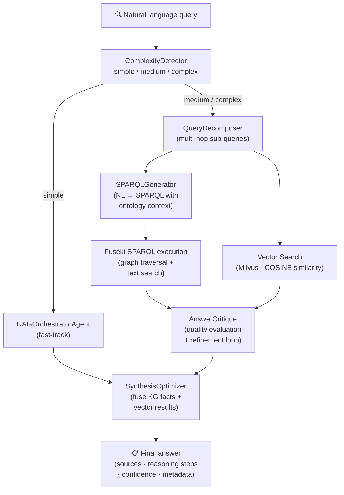
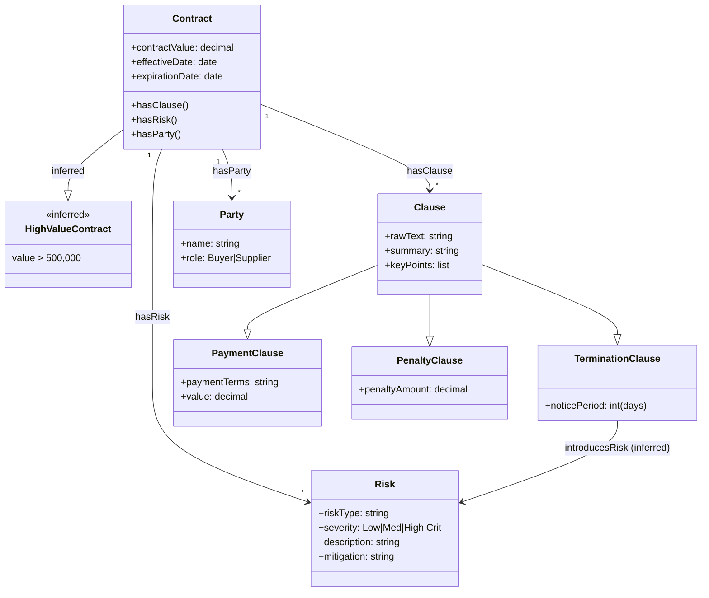
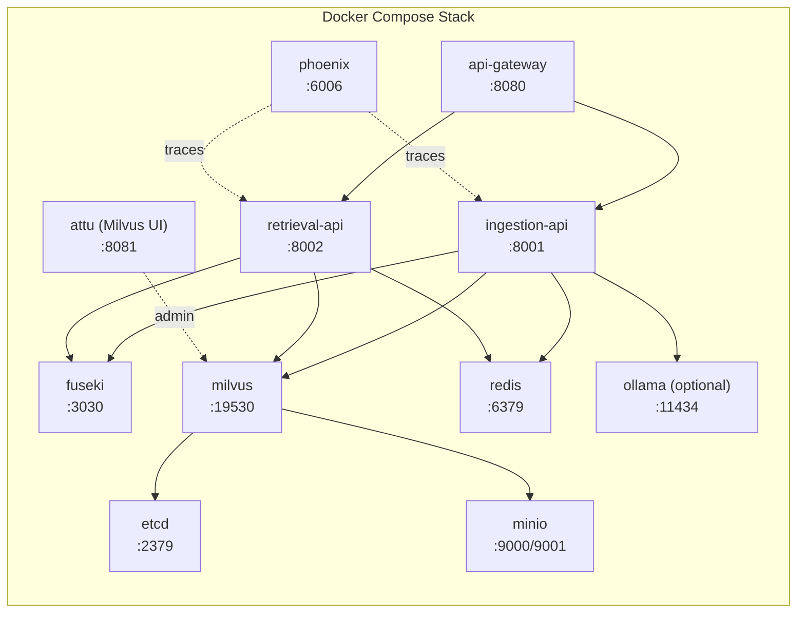
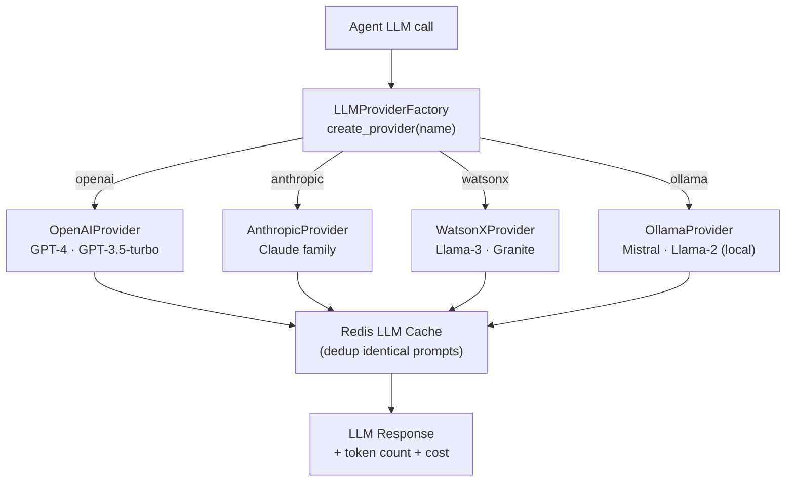

# Contract Knowledge Graph — Architecture & Flow Diagram

## System Overview

The Contract Knowledge Graph (CKG) is a multi-agent AI system for automated contract analysis. It combines **symbolic reasoning** (Apache Jena knowledge graphs + OWL ontologies), **statistical learning** (Milvus vector embeddings), and **large language models** (OpenAI, Anthropic, IBM WatsonX, Ollama) into a hybrid RAG pipeline.

---

## High-Level Architecture

```mermaid
graph TB
    subgraph CLIENT["Client Layer"]
        UI["REST Client / UI"]
    end

    subgraph GATEWAY["API Gateway · port 8080"]
        GW["gateway.py\nCORS · routing · health aggregation"]
    end

    subgraph SERVICES["Microservices"]
        ING["Ingestion API\nport 8001"]
        RET["Retrieval API\nport 8002"]
    end

    subgraph AGENTS_ING["Ingestion Pipeline (10 agents)"]
        A1["1 · DocumentIngestionAgent\nPDF / DOCX / TXT parsing"]
        A2["2 · ClauseExtractionAgent\nLLM-powered clause identification"]
        A3["3 · EntityExtractionAgent\nParties, dates, obligations"]
        A4["4 · ObligationRiskAgent\nRisk scoring & categorization"]
        A5["5 · OntologyAlignmentAgent\nSchema gap detection"]
        A6["6 · RDFGeneratorAgent\nOWL-compliant RDF/Turtle"]
        A7["7 · ValidationAgent\nSHACL shape validation"]
        A8["8 · FusekiLoaderAgent\nTriplestore loading"]
        A9["9 · ReasoningAgent\nJena inference rules"]
        A10["10 · VectorIndexAgent\nEmbedding + Milvus indexing"]
        A1-->A2-->A3-->A4-->A5-->A6-->A7-->A8-->A9-->A10
    end

    subgraph AGENTS_RET["Retrieval Pipeline"]
        B1["ComplexityDetector\nsimple / medium / complex"]
        B2["RAGOrchestrator\nfast-track for simple queries"]
        B3["QueryDecomposer\nmulti-hop sub-queries"]
        B4["SPARQLGenerator\nNL → SPARQL"]
        B5["FusekiQuery\nSPARQL execution"]
        B6["VectorSearch\nMilvus similarity search"]
        B7["IterativeOrchestrator\nanswer critique + refinement"]
        B8["SynthesisOptimizer\nfuse KG + vector results"]
        B1-->|simple|B2
        B1-->|complex|B3
        B3-->B4-->B5
        B3-->B6
        B5-->B7
        B6-->B7
        B7-->B8
        B2-->B8
    end

    subgraph STORAGE["Storage Layer"]
        FUSEKI["Apache Jena Fuseki\nport 3030\nSPARQL · TDB2 · Lucene · OWL inference"]
        MILVUS["Milvus Vector DB\nport 19530\n1024-dim · COSINE · IVF_FLAT"]
        MINIO["MinIO / S3\nport 9000\nDocument blob storage"]
        REDIS["Redis\nLLM output · embedding · query cache"]
    end

    subgraph LLM["LLM Provider Layer"]
        FACT["LLMProviderFactory"]
        OAI["OpenAI\nGPT-4 / GPT-3.5"]
        ANT["Anthropic\nClaude"]
        WX["IBM WatsonX\nLlama-3 / Granite"]
        OLL["Ollama\nlocal models"]
        FACT-->OAI & ANT & WX & OLL
    end

    subgraph OBS["Observability"]
        PHX["Arize Phoenix\nport 6006\nOpenTelemetry tracing"]
        LOG["structlog\nJSON structured logs"]
    end

    subgraph SCHEMA["Schema Evolution"]
        SE1["OntologyDesignerAgent"]
        SE2["PatternDetectionAgent"]
        SE3["RuleGeneratorAgent"]
        SE4["SHACLGeneratorAgent"]
        GOV["SchemaGovernance\nversion · conflict · approval"]
        SE1 & SE2 & SE3 & SE4 --> GOV
    end

    UI-->GW
    GW-->ING & RET
    ING-->AGENTS_ING
    RET-->AGENTS_RET
    AGENTS_ING-->|"RDF triples"| FUSEKI
    AGENTS_ING-->|"embeddings"| MILVUS
    AGENTS_ING-->|"blob store"| MINIO
    AGENTS_RET-->|"SPARQL queries"| FUSEKI
    AGENTS_RET-->|"similarity search"| MILVUS
    AGENTS_ING & AGENTS_RET --> FACT
    AGENTS_ING & AGENTS_RET --> REDIS
    AGENTS_ING & AGENTS_RET --> PHX
    AGENTS_ING & AGENTS_RET --> LOG
    AGENTS_ING-->SCHEMA
```

---

## Ingestion Data Flow

```mermaid
flowchart LR
    DOC["📄 PDF / DOCX"]
    DOC --> PARSE["Parse & extract text\n(pdfplumber / python-docx\n/ Docling DocTags)"]
    PARSE --> CLAUSE["Extract clauses\n(LLM · 9+ types:\nTermination, Payment,\nPenalty, Warranty …)"]
    CLAUSE --> ENTITY["Extract entities\n(parties, dates,\nobligations)"]
    ENTITY --> RISK["Score risks\n(severity: Low/Med/High/Crit\ntypes: Financial, Compliance …)"]
    RISK --> ALIGN["Align to ontology\n(OWL class mapping\ngap detection)"]
    ALIGN --> RDF["Generate RDF/Turtle\n(OWL-compliant graph\nnamed graphs per doc)"]
    RDF --> SHACL["Validate shapes\n(SHACL constraints)"]
    SHACL --> FUSEKI2["Load to Fuseki\n(TDB2 triplestore\n+ Lucene text index)"]
    FUSEKI2 --> INFER["Apply Jena rules\n(HighValueContract,\nTerminationRisk, …)"]
    INFER --> VEC["Embed & index\n(Sentence-Transformers\n→ Milvus 1024-dim)"]
    VEC --> DONE["✅ Ingestion complete\n(metrics: triples, clauses,\nrisks, vectors)"]
```

---

## Retrieval Data Flow

---

## Ontology & Rules Model

---

## Infrastructure Services

---

## LLM Provider Strategy

---

## Key Design Decisions

| Concern | Decision |
|---|---|
| **Semantic search** | Hybrid: SPARQL (structured KG traversal) + Milvus (embedding similarity) |
| **LLM coupling** | Factory pattern — swap provider with one config change, no code edits |
| **Schema rigidity** | Dynamic ontology evolution agents + SHACL validation |
| **Query complexity** | Automatic routing: simple → fast RAG, complex → decompose + critique loop |
| **Observability** | OpenTelemetry + Arize Phoenix for full LLM call tracing |
| **Ingestion resilience** | Async jobs with checkpointing — resumable after failure |
| **Inference** | Jena Rules engine derives HighValueContract, TerminationRisk, Obligations |
| **Document parsing** | Docling DocTags for structure-aware PDF/DOCX parsing |
