# Multi-Agent System Architecture

This document explains the multi-agent architecture used in the Contract Knowledge Graph system for document ingestion and query processing.

## Overview

The system uses specialized agents that collaborate to accomplish complex tasks:

- **Ingestion Agents (10+)** - Extract and structure contract data with batch processing
- **Retrieval Agents (6+)** - Answer queries using hybrid search with iterative refinement
- **Schema Evolution Agents** - Extend the ontology dynamically
- **Orchestrators** - Coordinate multi-agent workflows

## Architecture

```mermaid
graph TB
    subgraph "Ingestion Pipeline (10+ Agents)"
        DirScan[Directory Scanner]
        BatchProc[Batch Processor]
        DocAgent[Document Ingestion Agent]
        EnhancedDoc[Enhanced Document Ingestion]
        ClauseAgent[Clause Extraction Agent]
        EntityAgent[Entity Extraction Agent]
        ObligAgent[Obligation/Risk Agent]
        AlignAgent[Ontology Alignment Agent]
        OntSync[Ontology Sync Agent]
        RDFAgent[RDF Generator Agent]
        ValidAgent[Validation Agent]
        LoadAgent[Fuseki Loader Agent]
        ReasonAgent[Reasoning Agent]
        VectorAgent[Vector Index Agent]
        
        DirScan --> BatchProc
        BatchProc --> DocAgent
        DocAgent --> EnhancedDoc
        EnhancedDoc --> ClauseAgent
        ClauseAgent --> EntityAgent
        EntityAgent --> ObligAgent
        ObligAgent --> AlignAgent
        AlignAgent --> OntSync
        OntSync --> RDFAgent
        RDFAgent --> ValidAgent
        ValidAgent --> LoadAgent
        LoadAgent --> ReasonAgent
        ReasonAgent --> VectorAgent
    end
    
    subgraph "Retrieval Pipeline (6+ Agents)"
        QueryRouter[Query Router]
        SimpleAgent[Simple Query Agent]
        ReActAgent[ReAct Agent]
        QueryDecomp[Smart Query Decomposer]
        SPARQLAgent[SPARQL Generator]
        VectorSearch[Vector Search]
        SynthAgent[Synthesis Agent]
        CritiqueAgent[Answer Critique Agent]
        IterAgent[Iterative Orchestrator]
        
        QueryRouter --> SimpleAgent
        QueryRouter --> ReActAgent
        ReActAgent --> QueryDecomp
        QueryDecomp --> SPARQLAgent
        QueryDecomp --> VectorSearch
        SimpleAgent --> SynthAgent
        ReActAgent --> SynthAgent
        SynthAgent --> CritiqueAgent
        CritiqueAgent --> IterAgent
        IterAgent -.->|Refine if needed| ReActAgent
    end
    
    subgraph "Schema Evolution"
        PatternAgent[Pattern Detection Agent]
        OntologyAgent[Ontology Designer Agent]
        SHACLAgent[SHACL Generator Agent]
        RuleAgent[Rule Generator Agent]
        
        PatternAgent --> OntologyAgent
        PatternAgent --> SHACLAgent
        PatternAgent --> RuleAgent
    end
    
    style DocAgent fill:#e1f5ff
    style QueryRouter fill:#fff4e1
    style PatternAgent fill:#e8f5e9
    style CritiqueAgent fill:#ffe1e1
    style IterAgent fill:#ffe1e1
```



## Agent Types

### Base Agent

All agents inherit from [`BaseAgent`](../../agents/src/agents/shared/base.py):

```python
from agents.shared.base import BaseAgent

class MyAgent(BaseAgent):
    """Custom agent implementation."""
    
    def __init__(self, **kwargs):
        super().__init__(**kwargs)
        # Agent-specific initialization
    
    def process(self, input_data):
        # Agent logic
        pass
```

**Features:**
- Automatic LLM initialization
- Structured logging
- Error handling and retries
- Configuration management

### Ingestion Agents

#### 1. Document Ingestion Agent

**Purpose:** Extract text and metadata from documents

**Capabilities:**
- PDF text extraction
- DOCX parsing
- Metadata extraction (dates, parties, IDs)
- Document structure analysis

**Example:**
```python
from agents.ingestion.document_ingestion import DocumentIngestionAgent

agent = DocumentIngestionAgent()
result = agent.process(file_path="contract.pdf")

print(f"Text: {result.text}")
print(f"Metadata: {result.metadata}")
```

#### 2. Clause Extraction Agent

**Purpose:** Identify and extract contract clauses

**Capabilities:**
- Clause boundary detection
- Clause type classification
- Hierarchical structure preservation
- Context extraction

**Example:**
```python
from agents.ingestion.clause_extraction import ClauseExtractionAgent

agent = ClauseExtractionAgent()
clauses = agent.extract_clauses(text=contract_text)

for clause in clauses:
    print(f"{clause.type}: {clause.text}")
```

**Clause Types:**
- Termination clauses
- Payment clauses
- Liability clauses
- Confidentiality clauses
- Dispute resolution clauses

#### 3. Entity Extraction Agent

**Purpose:** Extract named entities from clauses

**Capabilities:**
- Party identification (buyers, suppliers)
- Date extraction
- Monetary value extraction
- Location extraction
- Custom entity types

**Example:**
```python
from agents.ingestion.entity_extraction import EntityExtractionAgent

agent = EntityExtractionAgent()
entities = agent.extract_entities(clauses=clauses)

for entity in entities:
    print(f"{entity.type}: {entity.value}")
```

#### 4. Obligation/Risk Agent

**Purpose:** Identify obligations and risks

**Capabilities:**
- Obligation extraction
- Risk identification
- Severity assessment
- Deadline detection

**Example:**
```python
from agents.ingestion.obligation_risk import ObligationRiskAgent

agent = ObligationRiskAgent()
result = agent.analyze(clauses=clauses)

print(f"Obligations: {len(result.obligations)}")
print(f"Risks: {len(result.risks)}")
```

#### 5. Ontology Alignment Agent

**Purpose:** Map extracted data to ontology concepts

**Capabilities:**
- Concept matching
- Similarity scoring
- Gap detection
- Suggestion generation

**Example:**
```python
from agents.ingestion.ontology_alignment import OntologyAlignmentAgent

agent = OntologyAlignmentAgent()
alignment = agent.align(
    entities=entities,
    ontology=ontology_graph
)

for suggestion in alignment.suggestions:
    print(f"New concept: {suggestion.name}")
```

#### 6. RDF Generator Agent

**Purpose:** Convert structured data to RDF triples

**Capabilities:**
- Triple generation
- URI creation
- Namespace management
- Graph serialization

**Example:**
```python
from agents.ingestion.rdf_generator import RDFGeneratorAgent

agent = RDFGeneratorAgent()
rdf = agent.generate_rdf(
    entities=entities,
    clauses=clauses,
    alignment=alignment
)

print(rdf.serialize(format="turtle"))
```

#### 7. Validation Agent

**Purpose:** Validate RDF against SHACL shapes

**Capabilities:**
- SHACL validation
- Error reporting
- Constraint checking
- Data quality assessment

**Example:**
```python
from agents.ingestion.validation_agent import ValidationAgent

agent = ValidationAgent()
result = agent.validate(
    rdf_graph=rdf,
    shacl_shapes=shapes
)

if not result.conforms:
    for violation in result.violations:
        print(f"Error: {violation.message}")
```

#### 8. Fuseki Loader Agent

**Purpose:** Load RDF data into Fuseki

**Capabilities:**
- Batch loading
- Transaction management
- Error recovery
- Load statistics

**Example:**
```python
from agents.ingestion.fuseki_loader import FusekiLoaderAgent

agent = FusekiLoaderAgent()
result = agent.load(
    rdf_graph=rdf,
    graph_uri="http://example.org/contracts"
)

print(f"Loaded {result.triples_loaded} triples")
```

#### 9. Reasoning Agent

**Purpose:** Apply inference rules

**Capabilities:**
- Rule-based reasoning
- Fact inference
- Consistency checking
- Materialization

**Example:**
```python
from agents.ingestion.reasoning_agent import ReasoningAgent

agent = ReasoningAgent()
result = agent.reason(
    graph_uri="http://example.org/contracts"
)

print(f"Inferred {result.facts_inferred} new facts")
```

#### 10. Vector Index Agent

**Purpose:** Create vector embeddings for semantic search

**Capabilities:**
- Text embedding
- Batch processing
- Index management
- Similarity search

**Example:**
```python
from agents.ingestion.vector_index import VectorIndexAgent

agent = VectorIndexAgent()
result = agent.index(
    clauses=clauses,
    document_id=doc_id
)

print(f"Indexed {result.vectors_created} vectors")
```

### Retrieval Agents

#### 1. Query Router

**Purpose:** Route queries to appropriate agents

**Capabilities:**
- Intent classification
- Complexity detection
- Strategy selection
- Template matching

**Example:**
```python
from agents.retrieval.query_classifier import QueryClassifier

classifier = QueryClassifier()
intent = classifier.classify(question="List all contracts")

print(f"Intent: {intent}")  # "list_contracts"
```

#### 2. ReAct Agent

**Purpose:** Multi-step reasoning for complex queries

**Capabilities:**
- Thought-action-observation loops
- Tool selection
- State management
- Iterative refinement

**Example:**
```python
from agents.retrieval.react_agent_langgraph import ReActLangGraphAgent

agent = ReActLangGraphAgent()
result = agent.query(
    question="What are the risks in IBM contracts?"
)

print(result.final_answer)
```

**ReAct Loop:**
```
Thought: I need to find contracts with IBM
Action: Execute SPARQL query for IBM contracts
Observation: Found 5 contracts

Thought: Now I need to extract risks from these contracts
Action: Search vector store for risk-related clauses
Observation: Found 12 risk clauses

Thought: I can now synthesize the answer
Action: Generate final answer
```

#### 3. SPARQL Generator Agent

**Purpose:** Generate SPARQL queries from natural language

**Capabilities:**
- Template-based generation
- Dynamic query construction
- Query optimization
- Error handling

**Example:**
```python
from agents.retrieval.sparql_generator import SPARQLGeneratorAgent

agent = SPARQLGeneratorAgent()
query = agent.generate(
    question="Find contracts with IBM",
    intent="find_contract"
)

print(query)
```

#### 4. Synthesis Agent

**Purpose:** Generate natural language answers

**Capabilities:**
- Context aggregation
- Answer generation
- Confidence scoring
- Citation inclusion

**Example:**
```python
from agents.retrieval.synthesis_optimizer import SynthesisOptimizer

agent = SynthesisOptimizer()
answer = agent.synthesize(
    question=question,
    kg_facts=facts,
    vector_results=results
)

print(answer.text)
print(f"Confidence: {answer.confidence}")
```

### Schema Evolution Agents

#### 1. Pattern Detection Agent

**Purpose:** Detect new concepts in data

**Capabilities:**
- Frequency analysis
- Semantic clustering
- Pattern recognition
- Suggestion generation

**Example:**
```python
from agents.schema_evolution.pattern_detection import PatternDetectionAgent

agent = PatternDetectionAgent()
patterns = agent.detect_patterns(
    entities=entities,
    existing_ontology=ontology
)

for pattern in patterns:
    print(f"New pattern: {pattern.name}")
```

#### 2. Ontology Designer Agent

**Purpose:** Generate OWL definitions

**Capabilities:**
- Class definition generation
- Property definition
- Hierarchy determination
- OWL serialization

**Example:**
```python
from agents.schema_evolution.ontology_designer import OntologyDesignerAgent

agent = OntologyDesignerAgent()
owl = agent.generate_owl(
    suggestion=pattern
)

print(owl.owl_triples)
```

#### 3. SHACL Generator Agent

**Purpose:** Create validation shapes

**Capabilities:**
- Shape generation
- Constraint definition
- Cardinality rules
- Datatype validation

**Example:**
```python
from agents.schema_evolution.shacl_generator import SHACLGeneratorAgent

agent = SHACLGeneratorAgent()
shapes = agent.generate_shacl(
    class_name="DataProtectionClause"
)

print(shapes.shacl_shapes)
```

#### 4. Rule Generator Agent

**Purpose:** Create inference rules

**Capabilities:**
- Rule pattern generation
- Condition definition
- Consequence specification
- Rule validation

**Example:**
```python
from agents.schema_evolution.rule_generator import RuleGeneratorAgent

agent = RuleGeneratorAgent()
rules = agent.generate_rules(
    class_name="DataProtectionClause"
)

print(rules.rules)
```

## Orchestrators

### Ingestion Orchestrator

Coordinates the complete ingestion pipeline:

```python
from agents.ingestion.ingestion_orchestrator import IngestionOrchestrator

orchestrator = IngestionOrchestrator(
    enable_schema_evolution=True,
    enable_reasoning=True,
    enable_vector_indexing=True
)

result = orchestrator.ingest_document(
    file_path="contract.pdf",
    graph_uri="http://example.org/contracts"
)

print(f"Success: {result.success}")
print(f"Clauses: {result.clauses_extracted}")
print(f"Triples: {result.triples_loaded}")
```

### Retrieval Orchestrator

Coordinates query processing:

```python
from agents.retrieval.retrieval_orchestrator_langgraph_v2 import LangGraphRetrievalOrchestrator

orchestrator = LangGraphRetrievalOrchestrator(
    enable_logging=True
)

result = orchestrator.query(
    question="What are the termination clauses?",
    graph_uri="http://example.org/contracts"
)

print(result["answer"])
```

## Agent Communication

### Message Passing

Agents communicate through structured messages:

```python
from pydantic import BaseModel

class AgentMessage(BaseModel):
    sender: str
    receiver: str
    content: dict
    timestamp: datetime
```

### State Management

LangGraph manages state across agents:

```python
from langgraph.graph import StateGraph

class PipelineState(TypedDict):
    document: dict
    clauses: list
    entities: list
    rdf: str
    
graph = StateGraph(PipelineState)
```

### Error Handling

Agents handle errors gracefully:

```python
try:
    result = agent.process(input_data)
except AgentError as e:
    logger.error(f"Agent failed: {e}")
    # Fallback logic
```

## Best Practices

### 1. Single Responsibility

Each agent has one clear purpose:

```python
# ✅ Good - focused agent
class ClauseExtractionAgent(BaseAgent):
    def extract_clauses(self, text: str) -> list[Clause]:
        pass

# ❌ Bad - too many responsibilities
class ProcessingAgent(BaseAgent):
    def extract_clauses(self, text: str): pass
    def extract_entities(self, text: str): pass
    def generate_rdf(self, data: dict): pass
```

### 2. Composability

Agents should be composable:

```python
# Compose agents in orchestrator
orchestrator = IngestionOrchestrator(
    clause_agent=ClauseExtractionAgent(),
    entity_agent=EntityExtractionAgent(),
    rdf_agent=RDFGeneratorAgent()
)
```

### 3. Testability

Agents should be independently testable:

```python
def test_clause_extraction():
    agent = ClauseExtractionAgent()
    clauses = agent.extract_clauses(sample_text)
    assert len(clauses) > 0
```

### 4. Observability

Log agent actions:

```python
class MyAgent(BaseAgent):
    def process(self, input_data):
        self.logger.info("Processing started")
        result = self._do_work(input_data)
        self.logger.info("Processing completed", 
                        extra={"result_count": len(result)})
        return result
```

## Performance Considerations

### Parallel Execution

Run independent agents in parallel:

```python
import asyncio

async def parallel_extraction(text):
    clause_task = asyncio.create_task(
        clause_agent.extract_clauses(text)
    )
    entity_task = asyncio.create_task(
        entity_agent.extract_entities(text)
    )
    
    clauses, entities = await asyncio.gather(
        clause_task, entity_task
    )
    return clauses, entities
```

### Batch Processing

Process multiple documents efficiently:

```python
orchestrator = IngestionOrchestrator()

results = orchestrator.batch_ingest(
    file_paths=["doc1.pdf", "doc2.pdf", "doc3.pdf"],
    batch_size=10
)
```

### Resource Management

Manage agent resources:

```python
from agents.ingestion.resource_manager import get_resource_manager

manager = get_resource_manager()
manager.set_limits(
    max_concurrent_agents=5,
    max_memory_mb=2048
)
```

## Next Steps

- [Hybrid RAG Architecture](../architecture/hybrid-rag.md) - Retrieval system design
- [Knowledge Graph Architecture](../architecture/knowledge-graph.md) - Graph structure
- [Ingestion Guide](../guide/ingestion.md) - Using ingestion agents
- [Retrieval Guide](../guide/retrieval.md) - Using retrieval agents