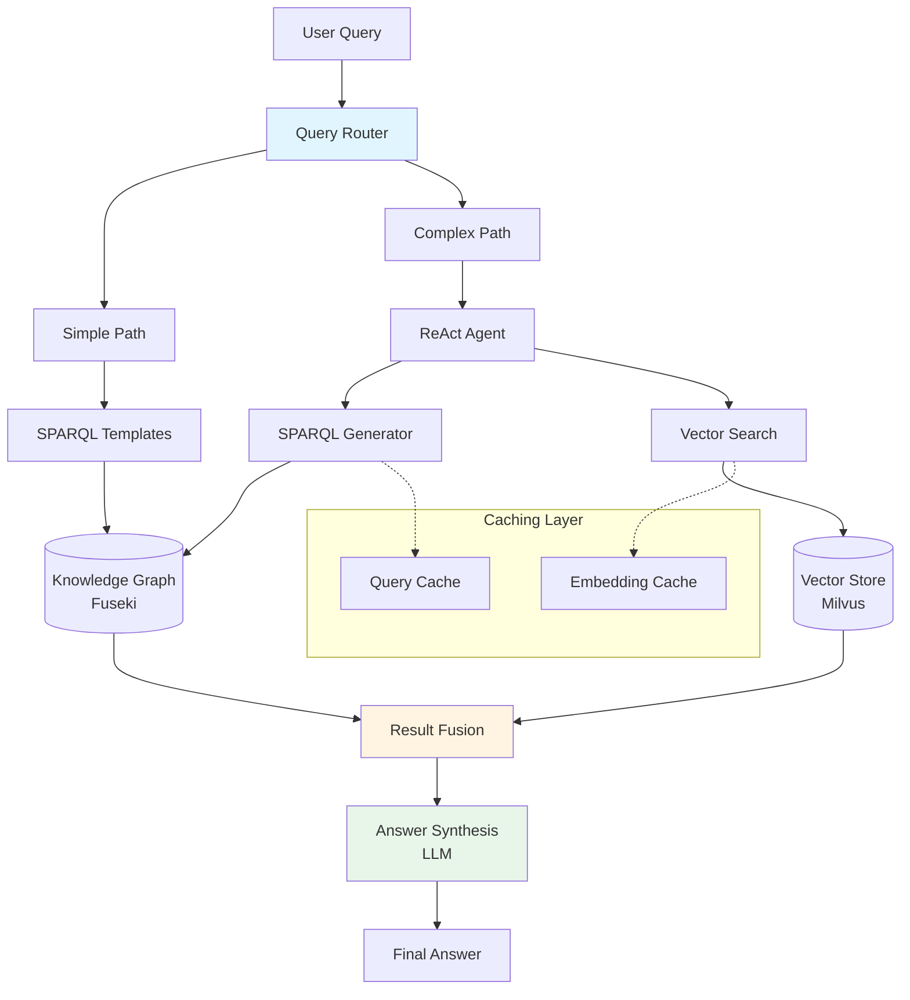
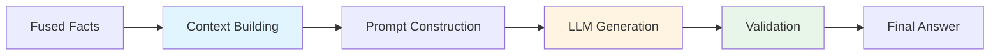
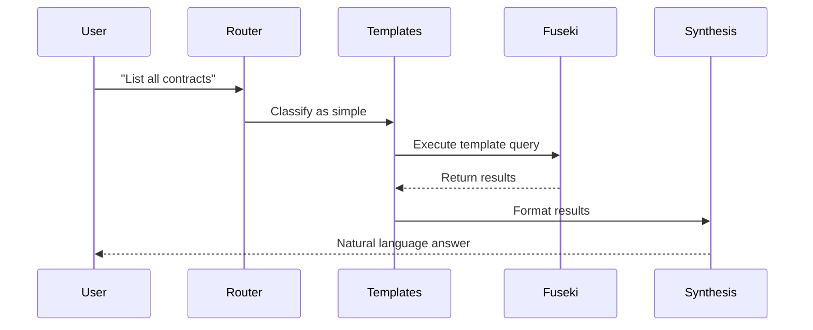
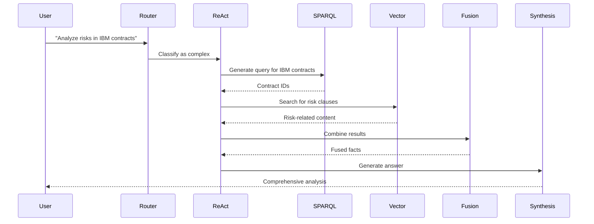

# Hybrid RAG Architecture

This document explains the Hybrid Retrieval-Augmented Generation (RAG) system that combines knowledge graph queries with vector similarity search for intelligent contract analysis.

## Overview

The Hybrid RAG system provides:

- **Structured Retrieval** - SPARQL queries over knowledge graph
- **Semantic Search** - Vector similarity for unstructured content
- **Intelligent Fusion** - Combines both approaches for optimal results
- **LLM Synthesis** - Natural language answer generation

## Architecture



## Components

### 1. Query Router

Routes queries based on complexity and intent:

```python
from agents.retrieval.query_classifier import QueryClassifier

classifier = QueryClassifier()

# Simple query - use templates
intent = classifier.classify("List all contracts")
# Returns: "list_contracts" → Simple path

# Complex query - use ReAct
intent = classifier.classify("Compare payment terms across IBM contracts")
# Returns: "compare_contracts" → Complex path
```

**Routing Logic:**

| Intent Pattern | Route | Reason |
|---------------|-------|--------|
| `list_*` | Simple | Direct SPARQL template |
| `find_*` | Simple | Single entity lookup |
| `get_details` | Simple | Straightforward retrieval |
| `analyze_*` | Complex | Requires reasoning |
| `compare_*` | Complex | Multi-step analysis |
| `summarize_*` | Complex | Aggregation needed |

### 2. Knowledge Graph Retrieval

#### SPARQL Templates

Fast, predictable queries for common patterns:

```python
from agents.retrieval.sparql_templates import SPARQLTemplateEngine

engine = SPARQLTemplateEngine()

# List contracts template
query = engine.generate(
    intent="list_contracts",
    params={}
)

# Result:
"""
PREFIX proc: <http://example.org/procurement#>
SELECT ?contract ?id ?value
WHERE {
    ?contract a proc:Contract ;
              proc:contractId ?id ;
              proc:hasValue ?value .
}
ORDER BY DESC(?value)
"""
```

**Available Templates:**
- `list_contracts` - All contracts
- `find_contract` - Contract by ID
- `list_clauses` - Clauses by type
- `find_party` - Contracts by party
- `get_obligations` - Contract obligations

#### Dynamic SPARQL Generation

For complex queries requiring reasoning:

```python
from agents.retrieval.sparql_generator import SPARQLGeneratorAgent

agent = SPARQLGeneratorAgent()

query = agent.generate(
    question="Find high-value contracts with termination clauses",
    context={
        "min_value": 1000000,
        "clause_type": "TerminationClause"
    }
)

# Generates optimized SPARQL with filters
```

**Query Optimization:**
- Selective pattern ordering
- FILTER placement
- OPTIONAL optimization
- Index utilization

### 3. Vector Similarity Search

Semantic search over contract content:

```python
from storage.vector.milvus_store import MilvusStore

store = MilvusStore()

# Search for similar clauses
results = store.search(
    query_text="data protection requirements",
    collection_name="contract_clauses",
    top_k=10,
    filters={"document_id": {"$in": contract_ids}}
)

for result in results:
    print(f"Score: {result.score}")
    print(f"Text: {result.text}")
```

**Search Parameters:**
- `top_k` - Number of results (default: 10)
- `metric_type` - Similarity metric (L2, IP, COSINE)
- `search_params` - Index-specific parameters
- `filters` - Metadata filtering

**Embedding Model:**
- Model: `sentence-transformers/all-MiniLM-L6-v2`
- Dimensions: 384
- Lazy loading: Initialized on first use
- Caching: Embeddings cached for reuse

### 4. Result Fusion

Combines structured and unstructured results:

```python
class ResultFusion:
    """Fuses KG facts with vector search results."""
    
    def fuse(
        self,
        kg_facts: list[dict],
        vector_results: list[dict],
        question: str
    ) -> dict:
        """
        Fusion strategies:
        1. Deduplication - Remove overlapping content
        2. Ranking - Score by relevance
        3. Contextualization - Add KG context to vectors
        4. Filtering - Remove low-confidence results
        """
        # Deduplicate
        unique_results = self._deduplicate(kg_facts, vector_results)
        
        # Rank by relevance
        ranked = self._rank_by_relevance(unique_results, question)
        
        # Add context
        contextualized = self._add_kg_context(ranked, kg_facts)
        
        return {
            "facts": contextualized,
            "kg_count": len(kg_facts),
            "vector_count": len(vector_results),
            "fused_count": len(contextualized)
        }
```

**Fusion Strategies:**

1. **Complementary** - KG provides structure, vectors provide content
2. **Verification** - Cross-validate results between sources
3. **Enrichment** - Enhance vector results with KG metadata
4. **Fallback** - Use vectors when KG has no results

### 5. Answer Synthesis

LLM generates natural language answers:

```python
from agents.retrieval.synthesis_optimizer import SynthesisOptimizer

synthesizer = SynthesisOptimizer()

answer = synthesizer.synthesize(
    question="What are the termination clauses?",
    kg_facts=kg_results,
    vector_results=vector_results,
    context={
        "contract_ids": ["ABC123", "XYZ789"],
        "total_contracts": 2
    }
)

print(answer.text)
print(f"Confidence: {answer.confidence}")
print(f"Citations: {answer.citations}")
```

**Synthesis Process:**



**Prompt Template:**
```python
SYNTHESIS_PROMPT = """
Based on the following information from the knowledge graph and document content:

Knowledge Graph Facts:
{kg_facts}

Relevant Document Excerpts:
{vector_results}

Question: {question}

Provide a comprehensive answer that:
1. Directly addresses the question
2. Cites specific contracts and clauses
3. Highlights key terms and conditions
4. Notes any risks or obligations

Answer:
"""
```

## Query Execution Flow

### Simple Query Flow



**Performance:** ~5-10 seconds

### Complex Query Flow



**Performance:** ~60-80 seconds

## Optimization Techniques

### 1. Query Caching

Cache SPARQL queries with TTL:

```python
from storage.sparql.query_cache import QueryCache

cache = QueryCache(max_size=1000, ttl_seconds=300)

# First execution - cache miss
result = cache.get_or_execute(query, execute_fn)  # ~2000ms

# Second execution - cache hit
result = cache.get_or_execute(query, execute_fn)  # ~50ms
```

**Cache Statistics:**
- Hit rate: 50-90%
- Average speedup: 40x
- Memory usage: ~100MB for 1000 queries

### 2. Embedding Caching

Cache vector embeddings:

```python
from storage.vector.embedding_cache import EmbeddingCache

cache = EmbeddingCache()

# Cache embeddings for reuse
embedding = cache.get_or_create(
    text="data protection requirements",
    model=embedding_model
)
```

### 3. Batch Processing

Process multiple queries efficiently:

```python
# Batch SPARQL queries
results = sparql_store.batch_query([
    query1, query2, query3
])

# Batch vector searches
results = vector_store.batch_search([
    "query1", "query2", "query3"
])
```

### 4. Parallel Execution

Execute KG and vector searches in parallel:

```python
import asyncio

async def hybrid_search(question):
    # Execute in parallel
    kg_task = asyncio.create_task(kg_search(question))
    vector_task = asyncio.create_task(vector_search(question))
    
    kg_results, vector_results = await asyncio.gather(
        kg_task, vector_task
    )
    
    return fuse_results(kg_results, vector_results)
```

**Speedup:** 30-40% reduction in total time

## Performance Metrics

### Latency Breakdown

| Component | Simple Query | Complex Query |
|-----------|-------------|---------------|
| Routing | 50ms | 50ms |
| KG Query | 2000ms | 3000ms |
| Vector Search | - | 1500ms |
| Fusion | - | 500ms |
| Synthesis | 500ms | 2000ms |
| **Total** | **2550ms** | **7050ms** |

### Accuracy Metrics

| Metric | Value | Description |
|--------|-------|-------------|
| Precision | 0.85 | Relevant results / Total results |
| Recall | 0.78 | Retrieved relevant / Total relevant |
| F1 Score | 0.81 | Harmonic mean of P&R |
| MRR | 0.72 | Mean Reciprocal Rank |

### Resource Usage

| Resource | Usage | Notes |
|----------|-------|-------|
| Memory | 2-4GB | Includes embeddings |
| CPU | 20-40% | During query processing |
| Disk I/O | Low | Mostly cached |
| Network | Moderate | Fuseki/Milvus calls |

## Best Practices

### 1. Choose the Right Approach

```python
# ✅ Use KG for structured queries
"List all contracts with IBM"
"Find contract ABC123"
"Get termination clauses"

# ✅ Use vectors for semantic queries
"Find clauses about data protection"
"Search for confidentiality requirements"
"Locate privacy-related terms"

# ✅ Use hybrid for complex queries
"Analyze risks in high-value contracts"
"Compare payment terms across suppliers"
"Summarize obligations in active contracts"
```

### 2. Optimize Query Patterns

```python
# ❌ Inefficient - broad then filter
results = get_all_contracts()
filtered = [c for c in results if c.value > 1000000]

# ✅ Efficient - filter in query
results = get_contracts(min_value=1000000)
```

### 3. Monitor Performance

```python
from observability.phoenix_tracer import setup_phoenix_tracing

# Enable tracing
setup_phoenix_tracing()

# Track metrics
result = orchestrator.query(question)
print(f"KG time: {result['kg_time_ms']}ms")
print(f"Vector time: {result['vector_time_ms']}ms")
print(f"Total time: {result['total_time_ms']}ms")
```

### 4. Handle Errors Gracefully

```python
try:
    kg_results = kg_search(question)
except KGError:
    # Fallback to vector search only
    kg_results = []
    logger.warning("KG search failed, using vectors only")

try:
    vector_results = vector_search(question)
except VectorError:
    # Continue with KG results only
    vector_results = []
    logger.warning("Vector search failed, using KG only")
```

## Troubleshooting

### Slow Queries

**Problem:** Queries taking >10 seconds

**Solutions:**
1. Check SPARQL query patterns
2. Verify cache hit rates
3. Optimize vector search parameters
4. Review LLM response times

### Low Relevance

**Problem:** Results not relevant to query

**Solutions:**
1. Improve query classification
2. Tune vector search parameters
3. Enhance fusion logic
4. Refine synthesis prompts

### High Resource Usage

**Problem:** Excessive memory/CPU usage

**Solutions:**
1. Enable lazy loading
2. Implement connection pooling
3. Reduce batch sizes
4. Clear caches periodically

## Next Steps

- [Multi-Agent System](../architecture/agents.md) - Agent architecture
- [Knowledge Graph](../architecture/knowledge-graph.md) - Graph structure
- [Retrieval Guide](../guide/retrieval.md) - Using the retrieval system
- [Performance Optimizations](../performance/optimizations.md) - Tuning guide