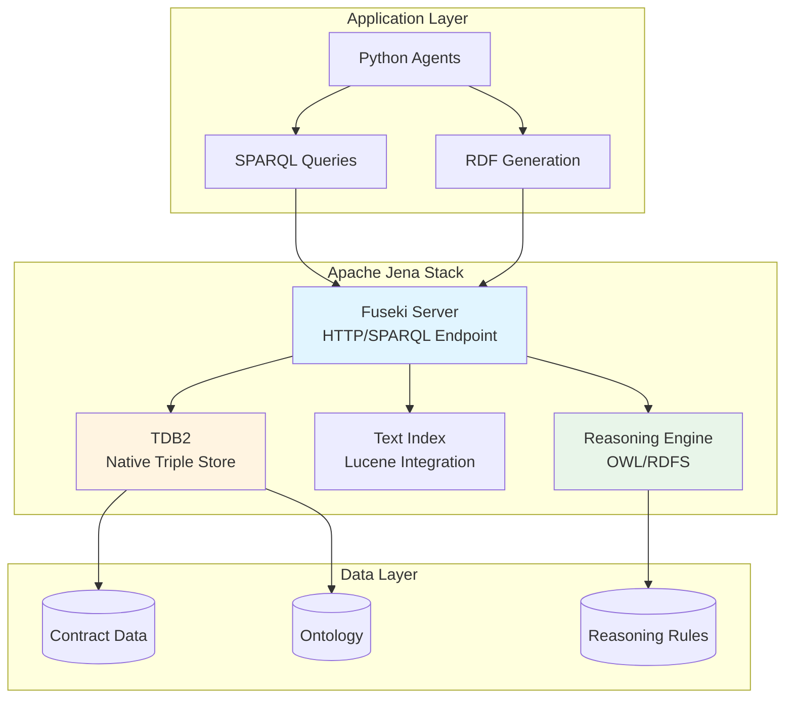

# Apache Jena Architecture

This document explains how Apache Jena is used in the Contract Knowledge Graph system for RDF storage, SPARQL querying, and semantic reasoning.

## Overview

Apache Jena provides the semantic web foundation for the system:

- **RDF Storage** - Triple store for knowledge graph data
- **SPARQL Queries** - Semantic query language
- **Reasoning Engine** - OWL/RDFS inference
- **Text Indexing** - Full-text search integration

## Architecture



## Components

### 1. Fuseki Server

**Purpose:** HTTP/SPARQL endpoint for RDF data access

**Features:**
- RESTful API for SPARQL queries
- Dataset management
- Authentication and access control
- Query optimization

**Configuration:**
```turtle
# fuseki-config.ttl
@prefix fuseki: <http://jena.apache.org/fuseki#> .
@prefix rdf: <http://www.w3.org/1999/02/22-rdf-syntax-ns#> .
@prefix rdfs: <http://www.w3.org/2000/01/rdf-schema#> .
@prefix tdb2: <http://jena.apache.org/2016/tdb#> .
@prefix text: <http://jena.apache.org/text#> .

<#service> rdf:type fuseki:Service ;
    fuseki:name "contracts" ;
    fuseki:endpoint [ 
        fuseki:operation fuseki:query ;
        fuseki:name "sparql"
    ] ;
    fuseki:endpoint [ 
        fuseki:operation fuseki:update ;
        fuseki:name "update"
    ] ;
    fuseki:dataset <#dataset> .

<#dataset> rdf:type text:TextDataset ;
    text:dataset <#tdb_dataset> ;
    text:index <#text_index> .

<#tdb_dataset> rdf:type tdb2:DatasetTDB2 ;
    tdb2:location "/fuseki/databases/contracts" .
```

**Endpoints:**
- `http://localhost:3030/contracts/sparql` - Query endpoint
- `http://localhost:3030/contracts/update` - Update endpoint
- `http://localhost:3030/contracts/data` - Graph Store Protocol

### 2. TDB2 Triple Store

**Purpose:** Native RDF storage with high performance

**Features:**
- Persistent storage on disk
- Transaction support (ACID)
- Efficient indexing (SPO, POS, OSP)
- Scalable to billions of triples

**Storage Layout:**
```
/fuseki/databases/contracts/
├── Data-0001/          # Triple data
│   ├── GSPO.dat       # Graph-Subject-Predicate-Object index
│   ├── GPOS.dat       # Graph-Predicate-Object-Subject index
│   └── GOSP.dat       # Graph-Object-Subject-Predicate index
├── prefixes.dat        # Namespace prefixes
└── stats.opt          # Query optimization statistics
```

**Performance:**
- **Insert:** ~10,000 triples/second
- **Query:** Sub-second for most patterns
- **Storage:** ~100 bytes per triple

### 3. Text Indexing

**Purpose:** Full-text search over RDF literals

**Features:**
- Lucene-based indexing
- Multi-field search
- Relevance ranking
- Faceted search

**Configuration:**
```turtle
<#text_index> a text:TextIndexLucene ;
    text:directory <file:/fuseki/text-index> ;
    text:entityMap <#entity_map> .

<#entity_map> a text:EntityMap ;
    text:defaultField "text" ;
    text:entityField "uri" ;
    text:map (
        [ text:field "text" ; 
          text:predicate rdfs:label ]
        [ text:field "description" ; 
          text:predicate rdfs:comment ]
        [ text:field "content" ; 
          text:predicate proc:hasContent ]
    ) .
```

**Usage:**
```sparql
PREFIX text: <http://jena.apache.org/text#>
PREFIX proc: <http://example.org/procurement#>

SELECT ?contract ?score
WHERE {
    ?contract text:query (proc:hasContent "data protection" 10) .
    ?contract text:score ?score .
}
ORDER BY DESC(?score)
```

### 4. Reasoning Engine

**Purpose:** Semantic inference over RDF data

**Supported Reasoners:**
- **RDFS:** Subclass/subproperty inference
- **OWL:** Full OWL reasoning (OWL-DL, OWL-Lite)
- **Generic Rules:** Custom Jena rules

**Rule Example:**
```
# Risk inference rule
[highValueRisk:
    (?contract proc:hasValue ?value)
    greaterThan(?value, 1000000)
    ->
    (?contract proc:hasRisk [
        rdf:type proc:FinancialRisk ;
        proc:severity "high" ;
        proc:description "High-value contract requires additional oversight"
    ])
]
```

**Inference Models:**
```python
from rdflib import Graph
from rdflib.plugins.stores import sparqlstore

# Query with inference
store = sparqlstore.SPARQLStore()
store.open("http://localhost:3030/contracts/sparql")

graph = Graph(store)

# Inferred triples included automatically
for s, p, o in graph.triples((None, RDF.type, PROC.HighRiskContract)):
    print(f"High risk: {s}")
```

## Data Model

### RDF Triples

All data stored as subject-predicate-object triples:

```turtle
@prefix proc: <http://example.org/procurement#> .
@prefix xsd: <http://www.w3.org/2001/XMLSchema#> .

# Contract entity
proc:Contract_ABC123 a proc:Contract ;
    proc:contractId "ABC123" ;
    proc:hasParty proc:Party_IBM ;
    proc:hasValue "5000000"^^xsd:decimal ;
    proc:startDate "2024-01-01"^^xsd:date ;
    proc:hasClause proc:Clause_001 .

# Party entity
proc:Party_IBM a proc:Supplier ;
    proc:partyName "IBM Corporation" ;
    proc:partyRole "supplier" .

# Clause entity
proc:Clause_001 a proc:TerminationClause ;
    proc:clauseText "Either party may terminate with 30 days notice" ;
    proc:noticePeriod "P30D"^^xsd:duration .
```

### Named Graphs

Organize data into logical graphs:

```sparql
# Insert into named graph
INSERT DATA {
    GRAPH <http://example.org/contracts/2024> {
        proc:Contract_ABC123 a proc:Contract ;
            proc:contractId "ABC123" .
    }
}

# Query specific graph
SELECT ?contract
FROM <http://example.org/contracts/2024>
WHERE {
    ?contract a proc:Contract .
}
```

## SPARQL Queries

### Basic Patterns

```sparql
PREFIX proc: <http://example.org/procurement#>

# Find all contracts
SELECT ?contract ?id
WHERE {
    ?contract a proc:Contract ;
              proc:contractId ?id .
}

# Filter by value
SELECT ?contract ?value
WHERE {
    ?contract a proc:Contract ;
              proc:hasValue ?value .
    FILTER (?value > 1000000)
}
```

### Property Paths

```sparql
# Find all clauses in contracts with IBM
SELECT ?clause ?text
WHERE {
    ?contract proc:hasParty/proc:partyName "IBM Corporation" ;
              proc:hasClause ?clause .
    ?clause proc:clauseText ?text .
}

# Multi-hop traversal
SELECT ?obligation
WHERE {
    ?contract proc:hasClause/proc:hasObligation ?obligation .
}
```

### Aggregation

```sparql
# Count contracts by party
SELECT ?party (COUNT(?contract) AS ?count)
WHERE {
    ?contract a proc:Contract ;
              proc:hasParty ?party .
}
GROUP BY ?party
ORDER BY DESC(?count)

# Average contract value
SELECT (AVG(?value) AS ?avgValue)
WHERE {
    ?contract a proc:Contract ;
              proc:hasValue ?value .
}
```

### Federated Queries

```sparql
# Query multiple endpoints
PREFIX proc: <http://example.org/procurement#>

SELECT ?contract ?party ?companyInfo
WHERE {
    # Local data
    ?contract a proc:Contract ;
              proc:hasParty ?party .
    
    # Remote data
    SERVICE <http://external-api.example.com/sparql> {
        ?party foaf:name ?companyInfo .
    }
}
```

## Performance Optimization

### Query Optimization

**1. Use Selective Patterns First:**
```sparql
# ❌ Slow - starts with broad pattern
SELECT ?contract
WHERE {
    ?contract a proc:Contract .
    ?contract proc:contractId "ABC123" .
}

# ✅ Fast - starts with specific pattern
SELECT ?contract
WHERE {
    ?contract proc:contractId "ABC123" .
    ?contract a proc:Contract .
}
```

**2. Limit Result Sets:**
```sparql
SELECT ?contract
WHERE {
    ?contract a proc:Contract .
}
LIMIT 100
OFFSET 0
```

**3. Use OPTIONAL Carefully:**
```sparql
# ❌ Slow - multiple OPTIONALs
SELECT ?contract ?value ?date ?party
WHERE {
    ?contract a proc:Contract .
    OPTIONAL { ?contract proc:hasValue ?value }
    OPTIONAL { ?contract proc:startDate ?date }
    OPTIONAL { ?contract proc:hasParty ?party }
}

# ✅ Fast - combine related OPTIONALs
SELECT ?contract ?value ?date ?party
WHERE {
    ?contract a proc:Contract .
    OPTIONAL { 
        ?contract proc:hasValue ?value ;
                  proc:startDate ?date ;
                  proc:hasParty ?party .
    }
}
```

### Indexing Strategy

TDB2 automatically maintains indexes:

- **SPO:** Subject-Predicate-Object
- **POS:** Predicate-Object-Subject
- **OSP:** Object-Subject-Predicate

**Query Planning:**
- Jena optimizer chooses best index
- Statistics updated periodically
- Manual optimization via `tdb2.tdbstats`

### Caching

Implement application-level caching:

```python
from storage.sparql.query_cache import QueryCache

cache = QueryCache(max_size=1000, ttl_seconds=300)

# Cache SPARQL results
result = cache.get_or_execute(query, execute_fn)
```

## Integration

### Python Integration

```python
from storage.sparql.fuseki_store import FusekiStore

# Initialize store
store = FusekiStore(
    endpoint="http://localhost:3030/contracts",
    graph_uri="http://example.org/contracts"
)

# Execute query
results = store.query("""
    PREFIX proc: <http://example.org/procurement#>
    SELECT ?contract ?id
    WHERE {
        ?contract a proc:Contract ;
                  proc:contractId ?id .
    }
""")

# Insert data
store.insert_triples("""
    PREFIX proc: <http://example.org/procurement#>
    INSERT DATA {
        proc:Contract_XYZ a proc:Contract ;
            proc:contractId "XYZ" .
    }
""")
```

### RDFLib Integration

```python
from rdflib import Graph, Namespace, Literal
from rdflib.namespace import RDF, RDFS

PROC = Namespace("http://example.org/procurement#")

# Create graph
g = Graph()
g.bind("proc", PROC)

# Add triples
contract = PROC.Contract_ABC123
g.add((contract, RDF.type, PROC.Contract))
g.add((contract, PROC.contractId, Literal("ABC123")))

# Serialize
print(g.serialize(format="turtle"))
```

## Best Practices

### 1. Use Appropriate Prefixes

```sparql
PREFIX proc: <http://example.org/procurement#>
PREFIX xsd: <http://www.w3.org/2001/XMLSchema#>
PREFIX rdfs: <http://www.w3.org/2000/01/rdf-schema#>
```

### 2. Validate Data with SHACL

```turtle
@prefix sh: <http://www.w3.org/ns/shacl#> .
@prefix proc: <http://example.org/procurement#> .

proc:ContractShape a sh:NodeShape ;
    sh:targetClass proc:Contract ;
    sh:property [
        sh:path proc:contractId ;
        sh:minCount 1 ;
        sh:datatype xsd:string
    ] .
```

### 3. Use Transactions

```python
# Atomic updates
store.begin_transaction()
try:
    store.insert_triples(data1)
    store.insert_triples(data2)
    store.commit_transaction()
except Exception as e:
    store.rollback_transaction()
    raise
```

### 4. Monitor Performance

```bash
# Check TDB2 statistics
tdb2.tdbstats --loc=/fuseki/databases/contracts

# Monitor query performance
tail -f /fuseki/logs/fuseki.log | grep "Query"
```

## Troubleshooting

### Slow Queries

**Problem:** Queries taking >5 seconds

**Solutions:**
1. Check query patterns (use selective patterns first)
2. Update TDB2 statistics
3. Add application-level caching
4. Consider denormalization for common patterns

### High Memory Usage

**Problem:** Fuseki consuming excessive memory

**Solutions:**
1. Increase JVM heap size: `-Xmx4g`
2. Tune TDB2 cache settings
3. Limit result set sizes
4. Use streaming for large results

### Index Corruption

**Problem:** TDB2 index errors

**Solutions:**
1. Stop Fuseki
2. Run `tdb2.tdbcompact` to rebuild indexes
3. Restart Fuseki
4. Verify data integrity

## Next Steps

- [Architecture Overview](../architecture/overview.md) - System design
- [Configuration Guide](../getting-started/configuration.md) - Setup details
- [Performance Optimizations](../performance/optimizations.md) - Tuning guide