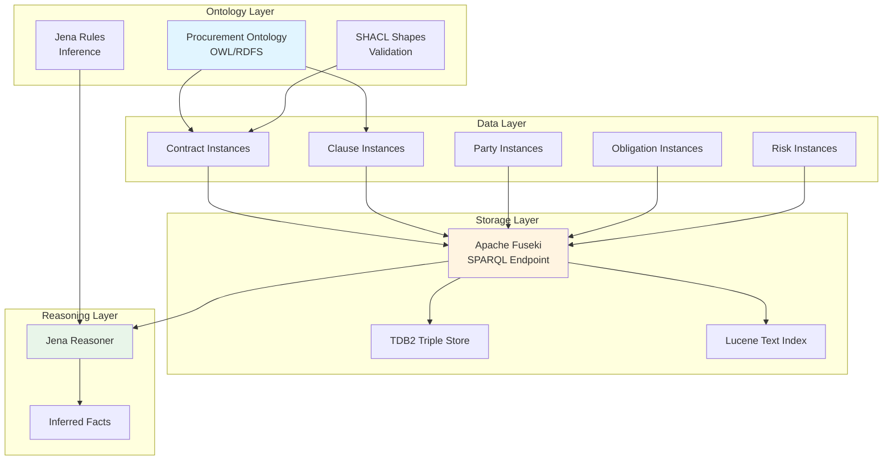

# Knowledge Graph Architecture

This document explains the structure and design of the Contract Knowledge Graph, including the ontology, data model, and reasoning capabilities.

## Overview

The Contract Knowledge Graph provides:

- **Semantic Data Model** - OWL ontology for contracts
- **RDF Triple Store** - Structured knowledge representation
- **SPARQL Queries** - Powerful query language
- **Reasoning Engine** - Automated inference
- **Schema Evolution** - Dynamic ontology extension

## Architecture



## Ontology Structure

### Core Classes

The procurement ontology defines the following class hierarchy:

```turtle
@prefix proc: <http://procurement.kg/ontology#> .
@prefix owl: <http://www.w3.org/2002/07/owl#> .
@prefix rdfs: <http://www.w3.org/2000/01/rdf-schema#> .

# Root Classes
proc:Contract a owl:Class ;
    rdfs:label "Contract" ;
    rdfs:comment "A procurement contract document" .

proc:Clause a owl:Class ;
    rdfs:label "Clause" ;
    rdfs:comment "A clause within a contract" .

proc:Party a owl:Class ;
    rdfs:label "Party" ;
    rdfs:comment "A party to a contract" .

proc:Obligation a owl:Class ;
    rdfs:label "Obligation" ;
    rdfs:comment "A contractual obligation" .

proc:Risk a owl:Class ;
    rdfs:label "Risk" ;
    rdfs:comment "An identified risk" .
```

### Clause Types

Specialized clause types for different contract provisions:

```turtle
# Clause Hierarchy
proc:TerminationClause rdfs:subClassOf proc:Clause ;
    rdfs:label "Termination Clause" ;
    rdfs:comment "Contract termination conditions" .

proc:PaymentClause rdfs:subClassOf proc:Clause ;
    rdfs:label "Payment Clause" ;
    rdfs:comment "Payment terms and conditions" .

proc:PenaltyClause rdfs:subClassOf proc:Clause ;
    rdfs:label "Penalty Clause" ;
    rdfs:comment "Penalties for breach or delay" .

proc:ConfidentialityClause rdfs:subClassOf proc:Clause ;
    rdfs:label "Confidentiality Clause" ;
    rdfs:comment "Non-disclosure provisions" .

proc:IndemnificationClause rdfs:subClassOf proc:Clause ;
    rdfs:label "Indemnification Clause" ;
    rdfs:comment "Liability provisions" .

proc:ForceMajeureClause rdfs:subClassOf proc:Clause ;
    rdfs:label "Force Majeure Clause" ;
    rdfs:comment "Force majeure provisions" .

proc:GoverningLawClause rdfs:subClassOf proc:Clause ;
    rdfs:label "Governing Law Clause" ;
    rdfs:comment "Jurisdiction provisions" .

proc:WarrantyClause rdfs:subClassOf proc:Clause ;
    rdfs:label "Warranty Clause" ;
    rdfs:comment "Warranties and guarantees" .
```

### Party Types

Different roles in contracts:

```turtle
proc:Buyer rdfs:subClassOf proc:Party ;
    rdfs:label "Buyer" ;
    rdfs:comment "The purchasing party" .

proc:Supplier rdfs:subClassOf proc:Party ;
    rdfs:label "Supplier" ;
    rdfs:comment "The supplying party" .

proc:Contractor rdfs:subClassOf proc:Party ;
    rdfs:label "Contractor" ;
    rdfs:comment "A contracting party" .
```

### Properties

#### Object Properties

Relationships between entities:

```turtle
proc:hasClause a owl:ObjectProperty ;
    rdfs:domain proc:Contract ;
    rdfs:range proc:Clause ;
    rdfs:label "has clause" .

proc:hasParty a owl:ObjectProperty ;
    rdfs:domain proc:Contract ;
    rdfs:range proc:Party ;
    rdfs:label "has party" .

proc:hasObligation a owl:ObjectProperty ;
    rdfs:domain proc:Clause ;
    rdfs:range proc:Obligation ;
    rdfs:label "has obligation" .

proc:hasRisk a owl:ObjectProperty ;
    rdfs:domain proc:Contract ;
    rdfs:range proc:Risk ;
    rdfs:label "has risk" .

proc:relatedTo a owl:ObjectProperty ;
    rdfs:domain proc:Clause ;
    rdfs:range proc:Clause ;
    rdfs:label "related to" .
```

#### Datatype Properties

Literal values:

```turtle
proc:contractId a owl:DatatypeProperty ;
    rdfs:domain proc:Contract ;
    rdfs:range xsd:string ;
    rdfs:label "contract ID" .

proc:hasValue a owl:DatatypeProperty ;
    rdfs:domain proc:Contract ;
    rdfs:range xsd:decimal ;
    rdfs:label "has value" .

proc:startDate a owl:DatatypeProperty ;
    rdfs:domain proc:Contract ;
    rdfs:range xsd:date ;
    rdfs:label "start date" .

proc:endDate a owl:DatatypeProperty ;
    rdfs:domain proc:Contract ;
    rdfs:range xsd:date ;
    rdfs:label "end date" .

proc:clauseText a owl:DatatypeProperty ;
    rdfs:domain proc:Clause ;
    rdfs:range xsd:string ;
    rdfs:label "clause text" .

proc:partyName a owl:DatatypeProperty ;
    rdfs:domain proc:Party ;
    rdfs:range xsd:string ;
    rdfs:label "party name" .

proc:severity a owl:DatatypeProperty ;
    rdfs:domain proc:Risk ;
    rdfs:range xsd:string ;
    rdfs:label "severity" .
```

## Data Model

### Contract Instance

Example of a complete contract in the knowledge graph:

```turtle
@prefix proc: <http://procurement.kg/ontology#> .
@prefix xsd: <http://www.w3.org/2001/XMLSchema#> .

# Contract
proc:Contract_ABC123 a proc:Contract ;
    proc:contractId "ABC123" ;
    proc:hasValue "5000000"^^xsd:decimal ;
    proc:startDate "2024-01-01"^^xsd:date ;
    proc:endDate "2025-12-31"^^xsd:date ;
    proc:hasParty proc:Party_IBM ;
    proc:hasParty proc:Party_Acme ;
    proc:hasClause proc:Clause_001 ;
    proc:hasClause proc:Clause_002 ;
    proc:hasRisk proc:Risk_001 .

# Parties
proc:Party_IBM a proc:Supplier ;
    proc:partyName "IBM Corporation" ;
    proc:partyRole "supplier" .

proc:Party_Acme a proc:Buyer ;
    proc:partyName "Acme Corp" ;
    proc:partyRole "buyer" .

# Clauses
proc:Clause_001 a proc:TerminationClause ;
    proc:clauseText "Either party may terminate with 30 days notice" ;
    proc:noticePeriod "P30D"^^xsd:duration ;
    proc:hasObligation proc:Obligation_001 .

proc:Clause_002 a proc:PaymentClause ;
    proc:clauseText "Payment due within 30 days of invoice" ;
    proc:paymentTerms "Net 30" .

# Obligations
proc:Obligation_001 a proc:Obligation ;
    proc:obligationType "notice" ;
    proc:obligationText "Provide 30 days written notice" ;
    proc:deadline "P30D"^^xsd:duration .

# Risks
proc:Risk_001 a proc:FinancialRisk ;
    proc:riskType "high_value" ;
    proc:severity "high" ;
    proc:description "High-value contract requires oversight" .
```

### Named Graphs

Organize data by source or time:

```turtle
# Contracts from 2024
GRAPH <http://procurement.kg/contracts/2024> {
    proc:Contract_ABC123 a proc:Contract .
    # ... contract data
}

# Contracts from specific document
GRAPH <http://procurement.kg/documents/doc1> {
    proc:Contract_XYZ789 a proc:Contract .
    # ... contract data
}
```

## Reasoning

### Inference Rules

Jena rules for automated reasoning:

```
# High-value contract inference
[highValueContract:
    (?contract rdf:type proc:Contract)
    (?contract proc:hasValue ?value)
    greaterThan(?value, 1000000)
    ->
    (?contract rdf:type proc:HighValueContract)
]

# Risk inference for high-value contracts
[highValueRisk:
    (?contract rdf:type proc:HighValueContract)
    ->
    (?contract proc:hasRisk [
        rdf:type proc:FinancialRisk ;
        proc:severity "high" ;
        proc:description "High-value contract requires additional oversight"
    ])
]

# Obligation deadline inference
[obligationDeadline:
    (?clause proc:hasObligation ?obligation)
    (?obligation proc:deadline ?deadline)
    (?contract proc:hasClause ?clause)
    (?contract proc:startDate ?startDate)
    ->
    (?obligation proc:dueDate (addDuration ?startDate ?deadline))
]

# Related clause inference
[relatedClauses:
    (?clause1 proc:clauseType ?type)
    (?clause2 proc:clauseType ?type)
    notEqual(?clause1, ?clause2)
    ->
    (?clause1 proc:relatedTo ?clause2)
]
```

### RDFS Inference

Automatic subclass reasoning:

```turtle
# If a contract has a TerminationClause
proc:Contract_ABC123 proc:hasClause proc:Clause_001 .
proc:Clause_001 a proc:TerminationClause .

# RDFS reasoner infers:
proc:Clause_001 a proc:Clause .  # Because TerminationClause subClassOf Clause
```

### OWL Inference

Property characteristics:

```turtle
# Symmetric property
proc:relatedTo a owl:SymmetricProperty .

# If clause1 related to clause2
proc:Clause_001 proc:relatedTo proc:Clause_002 .

# OWL reasoner infers:
proc:Clause_002 proc:relatedTo proc:Clause_001 .
```

## Validation

### SHACL Shapes

Data quality constraints:

```turtle
@prefix sh: <http://www.w3.org/ns/shacl#> .
@prefix proc: <http://procurement.kg/ontology#> .

# Contract shape
proc:ContractShape a sh:NodeShape ;
    sh:targetClass proc:Contract ;
    sh:property [
        sh:path proc:contractId ;
        sh:minCount 1 ;
        sh:maxCount 1 ;
        sh:datatype xsd:string ;
        sh:message "Contract must have exactly one ID"
    ] ;
    sh:property [
        sh:path proc:hasValue ;
        sh:minCount 1 ;
        sh:datatype xsd:decimal ;
        sh:minInclusive 0 ;
        sh:message "Contract must have a positive value"
    ] ;
    sh:property [
        sh:path proc:hasParty ;
        sh:minCount 2 ;
        sh:class proc:Party ;
        sh:message "Contract must have at least two parties"
    ] .

# Clause shape
proc:ClauseShape a sh:NodeShape ;
    sh:targetClass proc:Clause ;
    sh:property [
        sh:path proc:clauseText ;
        sh:minCount 1 ;
        sh:datatype xsd:string ;
        sh:minLength 10 ;
        sh:message "Clause must have text (min 10 characters)"
    ] .

# Party shape
proc:PartyShape a sh:NodeShape ;
    sh:targetClass proc:Party ;
    sh:property [
        sh:path proc:partyName ;
        sh:minCount 1 ;
        sh:maxCount 1 ;
        sh:datatype xsd:string ;
        sh:message "Party must have exactly one name"
    ] .
```

## Query Patterns

### Basic Queries

```sparql
# Find all contracts
SELECT ?contract ?id ?value
WHERE {
    ?contract a proc:Contract ;
              proc:contractId ?id ;
              proc:hasValue ?value .
}
ORDER BY DESC(?value)

# Find contracts by party
SELECT ?contract ?id
WHERE {
    ?contract a proc:Contract ;
              proc:contractId ?id ;
              proc:hasParty ?party .
    ?party proc:partyName "IBM Corporation" .
}

# Find clauses by type
SELECT ?clause ?text
WHERE {
    ?clause a proc:TerminationClause ;
            proc:clauseText ?text .
}
```

### Complex Queries

```sparql
# Find high-value contracts with risks
SELECT ?contract ?id ?value ?risk ?severity
WHERE {
    ?contract a proc:Contract ;
              proc:contractId ?id ;
              proc:hasValue ?value ;
              proc:hasRisk ?risk .
    ?risk proc:severity ?severity .
    FILTER (?value > 1000000)
}

# Find contracts with specific clause types
SELECT ?contract ?id (COUNT(?clause) AS ?clauseCount)
WHERE {
    ?contract a proc:Contract ;
              proc:contractId ?id ;
              proc:hasClause ?clause .
    ?clause a proc:TerminationClause .
}
GROUP BY ?contract ?id
HAVING (COUNT(?clause) > 1)

# Find obligations with approaching deadlines
SELECT ?obligation ?text ?dueDate
WHERE {
    ?obligation a proc:Obligation ;
                proc:obligationText ?text ;
                proc:dueDate ?dueDate .
    FILTER (?dueDate < "2024-12-31"^^xsd:date)
}
ORDER BY ?dueDate
```

### Property Paths

```sparql
# Find all clauses in contracts with IBM
SELECT ?clause ?text
WHERE {
    ?contract proc:hasParty/proc:partyName "IBM Corporation" ;
              proc:hasClause ?clause .
    ?clause proc:clauseText ?text .
}

# Find obligations in termination clauses
SELECT ?obligation ?text
WHERE {
    ?contract proc:hasClause/proc:hasObligation ?obligation .
    ?obligation proc:obligationText ?text .
}
```

## Schema Evolution

### Pattern Detection

Automatically detect new concepts:

```python
from agents.schema_evolution.pattern_detection import PatternDetectionAgent

detector = PatternDetectionAgent()

# Analyze extracted entities
patterns = detector.detect_patterns(
    entities=entities,
    existing_ontology=ontology,
    min_frequency=3
)

# New patterns found
for pattern in patterns:
    print(f"New concept: {pattern.name}")
    print(f"Frequency: {pattern.frequency}")
    print(f"Suggested parent: {pattern.parent_class}")
```

### OWL Generation

Generate definitions for new concepts:

```python
from agents.schema_evolution.ontology_designer import OntologyDesignerAgent

designer = OntologyDesignerAgent()

# Generate OWL for new clause type
owl = designer.generate_owl(
    suggestion={
        "name": "DataProtectionClause",
        "type": "class",
        "parent_class": "proc:Clause",
        "description": "Clause related to data protection"
    }
)

print(owl.owl_triples)
```

**Generated OWL:**
```turtle
proc:DataProtectionClause a owl:Class ;
    rdfs:subClassOf proc:Clause ;
    rdfs:label "Data Protection Clause" ;
    rdfs:comment "Clause specifying data protection requirements" .

proc:dataRetentionPeriod a owl:DatatypeProperty ;
    rdfs:domain proc:DataProtectionClause ;
    rdfs:range xsd:duration ;
    rdfs:label "data retention period" .
```

## Best Practices

### 1. Use Meaningful URIs

```turtle
# ✅ Good - descriptive URIs
proc:Contract_ABC123
proc:Clause_Termination_001
proc:Party_IBM_Corporation

# ❌ Bad - opaque URIs
proc:c1
proc:cl2
proc:p3
```

### 2. Leverage Inference

```turtle
# Define once, infer everywhere
proc:HighValueContract rdfs:subClassOf proc:Contract .

# Reasoner automatically classifies
proc:Contract_ABC123 a proc:HighValueContract .
# Inferred: proc:Contract_ABC123 a proc:Contract
```

### 3. Validate Data

```python
from agents.ingestion.validation_agent import ValidationAgent

validator = ValidationAgent()

# Validate before loading
result = validator.validate(
    rdf_graph=graph,
    shacl_shapes=shapes
)

if not result.conforms:
    for violation in result.violations:
        print(f"Error: {violation.message}")
```

### 4. Use Named Graphs

```sparql
# Organize by source
INSERT DATA {
    GRAPH <http://procurement.kg/contracts/2024> {
        proc:Contract_ABC123 a proc:Contract .
    }
}

# Query specific graph
SELECT ?contract
FROM <http://procurement.kg/contracts/2024>
WHERE {
    ?contract a proc:Contract .
}
```

## Performance Considerations

### Indexing

TDB2 automatically maintains indexes:
- SPO (Subject-Predicate-Object)
- POS (Predicate-Object-Subject)
- OSP (Object-Subject-Predicate)

### Query Optimization

```sparql
# ❌ Slow - starts with broad pattern
SELECT ?contract
WHERE {
    ?contract a proc:Contract .
    ?contract proc:contractId "ABC123" .
}

# ✅ Fast - starts with specific pattern
SELECT ?contract
WHERE {
    ?contract proc:contractId "ABC123" .
    ?contract a proc:Contract .
}
```

### Materialization

Pre-compute inferred facts:

```python
from agents.ingestion.reasoning_agent import ReasoningAgent

reasoner = ReasoningAgent()

# Materialize inferred triples
result = reasoner.reason(
    graph_uri="http://procurement.kg/contracts",
    materialize=True
)

print(f"Inferred {result.facts_inferred} facts")
```

## Next Steps

- [Apache Jena Architecture](../architecture/jena.md) - Jena implementation details
- [Multi-Agent System](../architecture/agents.md) - Agent architecture
- [Schema Evolution Guide](../guide/schema-evolution.md) - Extending the ontology
- [Ingestion Guide](../guide/ingestion.md) - Loading data into the graph