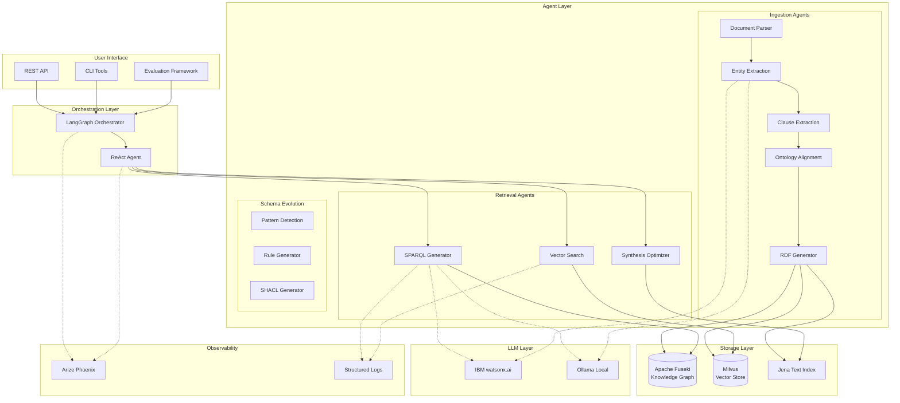
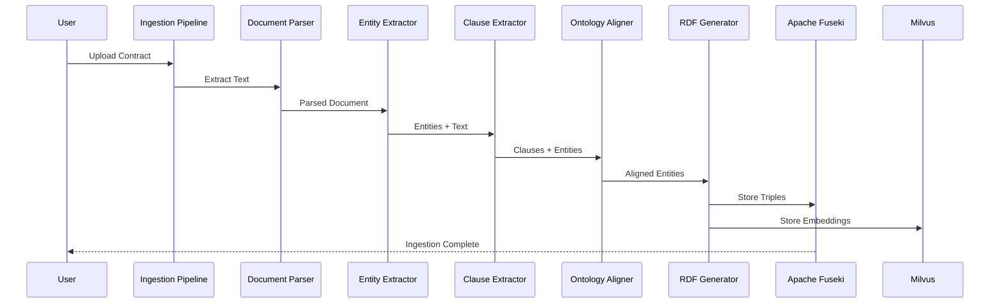
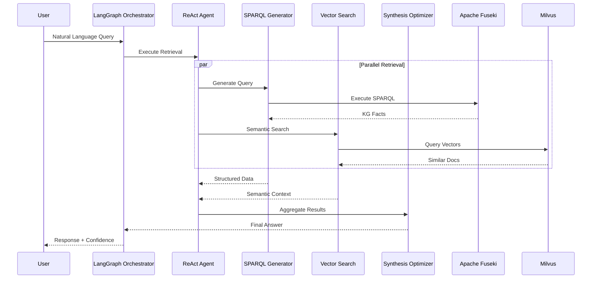

# Architecture Overview

Contract-Jena is built on a multi-layered architecture combining semantic knowledge graphs, vector databases, and LLM-powered agents.

## System Architecture

## Core Components

### 1. Orchestration Layer

**LangGraph Orchestrator** ([`retrieval_orchestrator_langgraph_v2.py`](../../agents/src/agents/retrieval/retrieval_orchestrator_langgraph_v2.py))
- State management for retrieval workflows
- Checkpointing for fault tolerance
- Phoenix tracing integration
- Simplified direct-to-ReAct routing (no query analysis overhead)

**ReAct Agent** ([`react_agent_optimized.py`](../../agents/src/agents/retrieval/react_agent_optimized.py))
- Reasoning and acting loop for complex queries
- Multi-step query decomposition
- Parallel retrieval execution
- Adaptive synthesis based on retrieved data

### 2. Agent Layer

#### Ingestion Agents

**Document Parser** ([`document_ingestion.py`](../../agents/src/agents/ingestion/document_ingestion.py))
- PDF/DOCX text extraction
- Structure preservation
- Metadata extraction

**Entity Extraction** ([`entity_extraction.py`](../../agents/src/agents/ingestion/entity_extraction.py))
- Named entity recognition
- Party identification
- Date/amount extraction

**Clause Extraction** ([`clause_extraction.py`](../../agents/src/agents/ingestion/clause_extraction.py))
- Clause type classification
- Obligation identification
- Risk assessment

**Ontology Alignment** ([`ontology_alignment.py`](../../agents/src/agents/ingestion/ontology_alignment.py))
- Entity-to-ontology mapping
- Relationship inference
- Consistency validation

**RDF Generator** ([`rdf_generator.py`](../../agents/src/agents/ingestion/rdf_generator.py))
- RDF triple generation
- Graph construction
- Multi-store persistence

#### Retrieval Agents

**SPARQL Generator** ([`sparql_generator.py`](../../agents/src/agents/retrieval/sparql_generator.py))
- Natural language to SPARQL translation
- Template-based fast path (95% speed improvement)
- LLM fallback for complex queries
- Query validation and optimization

**Vector Search** ([`vector_store.py`](../../agents/src/vector_store.py))
- Semantic similarity search
- Embedding generation
- Result ranking

**Synthesis Optimizer** ([`synthesis_optimizer.py`](../../agents/src/agents/retrieval/synthesis_optimizer.py))
- Multi-source result aggregation
- Confidence scoring
- Answer generation

### 3. Storage Layer

**Apache Fuseki** (SPARQL Store)
- RDF triple storage
- SPARQL query endpoint
- Text indexing integration
- Multi-graph support

**Milvus** (Vector Store)
- High-dimensional vector storage
- Approximate nearest neighbor search
- Collection management
- Index optimization

**Jena Text Index**
- Full-text search
- Keyword matching
- Fast exact-term retrieval

### 4. LLM Layer

**Provider Abstraction** ([`provider_factory.py`](../../agents/src/llm/provider_factory.py))
- Unified interface for multiple LLM providers
- Automatic provider selection
- Fallback handling

**Supported Providers:**
- **IBM watsonx.ai**: Production-grade, enterprise LLMs
- **Ollama**: Local deployment, privacy-focused

### 5. Observability

**Phoenix Tracing** ([`phoenix_tracer.py`](../../agents/src/observability/phoenix_tracer.py))
- LLM call tracking
- Span visualization
- Performance metrics
- Cost tracking

**Structured Logging** ([`logging_config.py`](../../agents/src/logging_config.py))
- JSON-formatted logs
- Context propagation
- Module-specific loggers
- Centralized log management

## Data Flow

### Ingestion Pipeline

### Retrieval Pipeline

## Key Design Decisions

### 1. Hybrid RAG Architecture

**Why:** Combines strengths of multiple retrieval methods
- **Knowledge Graph**: Precise structured queries
- **Vector Search**: Semantic similarity
- **Text Index**: Fast keyword matching

**Trade-off:** Increased complexity vs. better accuracy

### 2. Multi-Agent System

**Why:** Separation of concerns and specialization
- Each agent focuses on specific task
- Easier to test and maintain
- Can be optimized independently

**Trade-off:** Coordination overhead vs. modularity

### 3. LangGraph for Orchestration

**Why:** State management and observability
- Built-in checkpointing
- Phoenix integration
- Workflow visualization

**Trade-off:** Learning curve vs. powerful features

### 4. Template-Based SPARQL

**Why:** Performance optimization for common queries
- 95% speed improvement for simple queries
- LLM fallback for complex cases
- Maintains flexibility

**Trade-off:** Template maintenance vs. speed

### 5. Simplified Architecture (Recent)

**Why:** Removed query analysis overhead
- 60-80s saved per query
- Fewer failure points
- ReAct handles routing naturally

**Trade-off:** Less explicit routing vs. faster execution

## Performance Characteristics

| Component | Latency | Throughput | Scalability |
|-----------|---------|------------|-------------|
| SPARQL Query (cached) | 10-50ms | High | Horizontal |
| SPARQL Query (uncached) | 100-500ms | Medium | Horizontal |
| Vector Search | 50-200ms | High | Horizontal |
| LLM Call (watsonx) | 1-5s | Low | Provider-limited |
| LLM Call (Ollama) | 2-10s | Low | Hardware-limited |
| Full Retrieval | 5-120s | Low | Vertical |

## Scalability Considerations

### Horizontal Scaling
- **Fuseki**: Cluster mode with TDB2
- **Milvus**: Distributed deployment
- **Agents**: Stateless, can run in parallel

### Vertical Scaling
- **LLM Inference**: GPU acceleration
- **Vector Search**: Memory optimization
- **SPARQL Queries**: Query optimization

### Bottlenecks
1. **LLM API calls**: Rate limits, latency
2. **SPARQL generation**: Complex query construction
3. **Vector search**: High-dimensional similarity

## Next Steps

- **[Multi-Agent System](agents.md)**: Deep dive into agent architecture
- **[Hybrid RAG](hybrid-rag.md)**: Retrieval strategy details
- **[Performance Optimizations](performance.md)**: Optimization techniques
- **[Knowledge Graph](knowledge-graph.md)**: Ontology and schema design