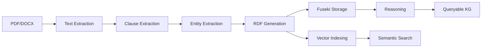
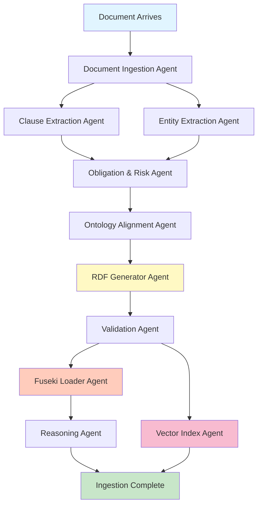
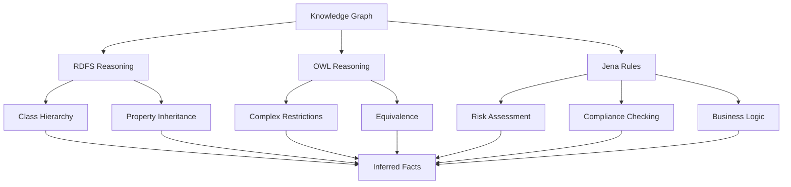

# Ingestion Pipeline Deep Dive

**Complete Guide to Contract Document Ingestion**

This comprehensive guide explains every step of the document ingestion pipeline, from raw PDF/DOCX files to queryable knowledge graph and vector embeddings. Perfect for newcomers to understand the entire system architecture.

---

## Table of Contents

1. [Overview](#overview)
2. [Pipeline Architecture](#pipeline-architecture)
3. [Step-by-Step Process](#step-by-step-process)
4. [Data Storage](#data-storage)
5. [Ontology & Schema](#ontology--schema)
6. [Reasoning & Inference](#reasoning--inference)
7. [Examples](#examples)

---

## Overview

The ingestion pipeline transforms unstructured contract documents into a rich, queryable knowledge graph with semantic search capabilities. It combines:

- **LLM-powered extraction** for intelligent clause and entity identification
- **RDF/OWL knowledge graph** for structured semantic representation
- **Vector embeddings** for fast semantic search
- **Reasoning engine** for automatic inference of risks and compliance issues

### What Happens to a Document?



---

## Pipeline Architecture

### High-Level Flow



### Agent Responsibilities

| Agent | Input | Output | Purpose |
|-------|-------|--------|---------|
| **Document Ingestion** | PDF/DOCX file | Extracted text + metadata | Extract raw text from documents |
| **Clause Extraction** | Document text | Typed clauses with attributes | Identify and classify contract clauses |
| **Entity Extraction** | Document text | Parties, dates, amounts | Extract named entities |
| **Obligation & Risk** | Clauses + entities | Obligations and risks | Analyze obligations and identify risks |
| **Ontology Alignment** | Extracted data | Aligned concepts | Map to ontology classes |
| **RDF Generator** | All extracted data | RDF triples (Turtle) | Convert to semantic graph format |
| **Validation** | RDF triples | Validation report | Check syntax and semantics |
| **Fuseki Loader** | Valid RDF | Load confirmation | Store in triplestore |
| **Vector Index** | Clauses | Embeddings | Create semantic search index |
| **Reasoning** | Knowledge graph | Inferred facts | Apply inference rules |

---

## Step-by-Step Process

### Step 1: Document Ingestion

**Agent:** `DocumentIngestionAgent`  
**File:** `agents/src/agents/ingestion/document_ingestion.py`

#### What Happens

1. **File Reading**: Reads PDF, DOCX, or TXT files
2. **Text Extraction**: 
   - PDF: Uses `pdfplumber` to extract text page by page
   - DOCX: Extracts paragraphs and tables using `python-docx`
   - TXT: Direct UTF-8 reading
3. **Document ID Generation**: Creates SHA-256 hash of file content
4. **Optional Normalization**: LLM cleans OCR errors and normalizes whitespace

#### Example Input/Output

**Input:**
```
File: contract_2024.pdf (15 pages)
```

**Output:**
```python
ExtractedDocument(
    document_id="doc_a3f5b2c8d1e4f6a7",
    filename="contract_2024.pdf",
    text="[Page 1]\nSERVICE AGREEMENT\n\nThis agreement...",
    page_count=15,
    metadata={
        "pdf_info": {"Author": "Legal Dept", "CreationDate": "2024-01-15"}
    }
)
```

#### Key Properties Extracted

- `document_id`: Unique identifier (hash-based)
- `filename`: Original file name
- `text`: Full extracted text with page markers
- `page_count`: Number of pages
- `metadata`: PDF metadata, paragraph counts, etc.

---

### Step 2: Clause Extraction

**Agent:** `ClauseExtractionAgent`  
**File:** `agents/src/agents/ingestion/clause_extraction.py`

#### What Happens

1. **LLM Analysis**: Sends document text to LLM with detailed extraction prompt
2. **Clause Identification**: Identifies distinct clauses in the contract
3. **Classification**: Assigns semantic types (TerminationClause, PaymentClause, etc.)
4. **Attribute Extraction**: Extracts structured data (notice periods, payment terms, etc.)
5. **Summarization**: Creates summaries and key points for each clause

#### Clause Types Recognized

- **TerminationClause**: Contract termination conditions
- **PaymentClause**: Payment terms and schedules
- **PenaltyClause**: Penalties for breach or delay
- **ConfidentialityClause**: Non-disclosure provisions
- **IndemnificationClause**: Liability and indemnification
- **ForceMajeureClause**: Force majeure provisions
- **GoverningLawClause**: Jurisdiction and governing law
- **WarrantyClause**: Warranties and guarantees
- **InsuranceClause**: Insurance requirements
- **ComplianceClause**: Regulatory compliance

#### Example Output

```python
ExtractedClause(
    clause_id="cl_1",
    clause_type="TerminationClause",
    section_number="12.1",
    title="Termination for Convenience",
    raw_text="Either party may terminate this Agreement upon thirty (30) days written notice...",
    summary="Allows either party to terminate the agreement with 30 days written notice without cause.",
    key_points=[
        "Either party may terminate",
        "30 days written notice required",
        "No cause needed (convenience termination)",
        "Notice must be in writing"
    ],
    structured_summary={
        "notice_period_days": 30,
        "termination_conditions": ["convenience"],
        "notice_method": "written"
    },
    attributes={
        "notice_period": 30,
        "notice_period_days": 30,
        "termination_conditions": ["convenience", "no-cause"]
    }
)
```

#### Critical Attributes Extracted

**For TerminationClause:**
- `notice_period`: Days of notice required (e.g., 30)
- `termination_conditions`: List of conditions (convenience, breach, default)
- `cancellation_charge`: Any termination fees

**For PaymentClause:**
- `payment_terms`: Full description (e.g., "net 30")
- `payment_days`: Number of days (e.g., 30)
- `payment_schedule`: When payments are due
- `late_fee`: Late payment penalties

**For PenaltyClause:**
- `penalty_amount`: Monetary penalty
- `penalty_percentage`: Percentage-based penalty
- `penalty_conditions`: When penalty applies

---

### Step 3: Entity Extraction

**Agent:** `EntityExtractionAgent`  
**File:** `agents/src/agents/ingestion/entity_extraction.py`

#### What Happens

1. **Party Identification**: Extracts buyer, supplier, contractors
2. **Date Extraction**: Identifies effective dates, expiration dates, milestones
3. **Amount Extraction**: Finds contract values, penalties, thresholds
4. **Jurisdiction Extraction**: Identifies governing law and venues

#### Example Output

```python
EntityExtractionResult(
    document_id="doc_a3f5b2c8d1e4f6a7",
    parties=[
        Party(
            party_id="party_1",
            name="Acme Corporation",
            role="Buyer",
            address="123 Main St, New York, NY 10001",
            contact_info={"email": "legal@acme.com"},
            aliases=["Acme", "the Company", "Buyer"]
        ),
        Party(
            party_id="party_2",
            name="TechServices Inc.",
            role="Supplier",
            address="456 Tech Blvd, San Francisco, CA 94105",
            aliases=["TechServices", "Supplier", "Vendor"]
        )
    ],
    dates=[
        ContractDate(
            date_type="EffectiveDate",
            date_value="2024-01-01",
            date_description="Contract effective January 1, 2024",
            reference_clause="Section 2.1"
        ),
        ContractDate(
            date_type="ExpirationDate",
            date_value="2026-12-31",
            date_description="Contract expires December 31, 2026",
            reference_clause="Section 2.2"
        )
    ],
    amounts=[
        MonetaryAmount(
            amount_id="amt_1",
            amount_type="ContractValue",
            value=500000.00,
            currency="USD",
            description="Total contract value for 3-year term",
            reference_clause="Section 4.1"
        )
    ],
    jurisdictions=[
        Jurisdiction(
            jurisdiction_id="jur_1",
            name="State of New York",
            jurisdiction_type="State",
            applies_to="GoverningLaw"
        )
    ],
    contract_title="IT Services Agreement",
    contract_type="Services Agreement"
)
```

---

### Step 4: RDF Generation

**Agent:** `RDFGeneratorAgent`  
**File:** `agents/src/agents/ingestion/rdf_generator.py`

#### What Happens

1. **Graph Creation**: Creates RDFLib graph with proper namespaces
2. **Contract Entity**: Generates contract resource with properties
3. **Clause Entities**: Creates typed clause resources with attributes
4. **Party Entities**: Adds party resources and relationships
5. **Linking**: Connects all entities with semantic relationships
6. **Serialization**: Outputs Turtle/RDF format

#### Namespaces Used

```turtle
@prefix proc: <http://procurement.kg/ontology#> .
@prefix contract: <http://procurement.kg/contract#> .
@prefix rdf: <http://www.w3.org/1999/02/22-rdf-syntax-ns#> .
@prefix rdfs: <http://www.w3.org/2000/01/rdf-schema#> .
@prefix xsd: <http://www.w3.org/2001/XMLSchema#> .
@prefix owl: <http://www.w3.org/2002/07/owl#> .
```

#### Example RDF Output

```turtle
@prefix proc: <http://procurement.kg/ontology#> .
@prefix contract: <http://procurement.kg/contract#> .
@prefix xsd: <http://www.w3.org/2001/XMLSchema#> .

# Contract Entity
contract:Contract_a3f5b2c8d1e4f6a7
    a proc:Contract ;
    rdfs:label "IT Services Agreement" ;
    proc:contractValue "500000.00"^^xsd:decimal ;
    proc:effectiveDate "2024-01-01"^^xsd:date ;
    proc:expirationDate "2026-12-31"^^xsd:date ;
    proc:status "Active" ;
    proc:hasClause contract:Clause_001 ;
    proc:hasParty contract:Party_1 .

# Termination Clause
contract:Clause_001
    a proc:TerminationClause, proc:Clause ;
    rdfs:label "Termination for Convenience - 12.1" ;
    proc:sectionNumber "12.1" ;
    proc:rawText "Either party may terminate..." ;
    proc:summary "Allows termination with 30 days notice" ;
    proc:noticePeriod "30"^^xsd:integer ;
    proc:hasKeyPoint "Either party may terminate" ;
    proc:hasKeyPoint "30 days written notice required" .

# Party Entity
contract:Party_1
    a proc:Buyer, proc:Party ;
    rdfs:label "Acme Corporation" .
```

#### Properties Generated

**Contract Properties:**
- `proc:contractValue`: Total contract value (decimal)
- `proc:effectiveDate`: Start date (xsd:date)
- `proc:expirationDate`: End date (xsd:date)
- `proc:status`: Contract status (Active, Expired, etc.)
- `proc:hasClause`: Links to clause entities
- `proc:hasParty`: Links to party entities

**Clause Properties:**
- `proc:sectionNumber`: Section reference (string)
- `proc:rawText`: Full clause text (string)
- `proc:summary`: Brief summary (string)
- `proc:noticePeriod`: Notice period in days (integer)
- `proc:paymentDays`: Payment terms in days (integer)
- `proc:penaltyAmount`: Penalty amount (decimal)
- `proc:hasKeyPoint`: Key points (repeatable)

---

### Step 5: Fuseki Storage

**Agent:** `FusekiLoaderAgent`  
**File:** `agents/src/agents/ingestion/fuseki_loader.py`

#### What Happens

1. **Connection**: Connects to Apache Jena Fuseki triplestore
2. **Named Graph**: Creates or uses named graph for isolation
3. **Upload**: POSTs RDF data to Fuseki's Graph Store Protocol endpoint
4. **Verification**: Confirms successful load with triple count

#### Fuseki Endpoints

```
Query Endpoint:  http://fuseki:3030/contracts/sparql
Update Endpoint: http://fuseki:3030/contracts/update
Graph Store:     http://fuseki:3030/contracts/data
```

#### Named Graph Strategy

Each document gets its own named graph for isolation:

```turtle
# Document stored in named graph
GRAPH <http://procurement.kg/graph/doc_a3f5b2c8d1e4f6a7> {
    contract:Contract_a3f5b2c8d1e4f6a7 a proc:Contract .
    # ... all triples for this document
}
```

**Benefits:**
- Easy to delete/update single documents
- Query across all documents or specific ones
- Track provenance and versioning

#### Example SPARQL Query

```sparql
# Query all contracts
SELECT ?contract ?title ?value
WHERE {
    GRAPH ?g {
        ?contract a proc:Contract ;
                  rdfs:label ?title ;
                  proc:contractValue ?value .
    }
}
ORDER BY DESC(?value)
```

---

### Step 6: Vector Indexing

**Agent:** `VectorIndexAgent`  
**File:** `agents/src/agents/ingestion/vector_index.py`

#### What Happens

1. **Embedding Generation**: Creates vector embeddings for each clause
2. **Metadata Bundling**: Combines summary + key points + structured data
3. **Milvus Upload**: Stores embeddings with metadata in Milvus
4. **Index Creation**: Creates COSINE similarity index for fast search

#### Milvus Schema

```python
Collection Schema: "contract_clauses_v2"

Fields:
- id (VARCHAR, 128): Primary key (clause_id)
- clause_id (VARCHAR, 128): Clause identifier
- contract_id (VARCHAR, 128): Parent contract ID
- clause_type (VARCHAR, 64): Type (TerminationClause, etc.)
- text (VARCHAR, 65535): Full clause text
- summary (VARCHAR, 4096): Short summary
- key_points (VARCHAR, 8192): Key points (JSON)
- structured_summary (VARCHAR, 16384): Structured data (JSON)
- rdf_uri (VARCHAR, 512): Link to RDF entity
- graph_uri (VARCHAR, 512): Named graph URI
- embedding (FLOAT_VECTOR, 384): Semantic embedding

Index: IVF_FLAT with COSINE metric
```

#### Embedding Strategy

Embeddings are computed from a rich text bundle:

```python
embedding_text = f"""
{clause.summary}

Key Points:
{' '.join(clause.key_points)}

Structured Data:
{json.dumps(clause.structured_summary)}
"""

embedding = model.encode(embedding_text)
```

**Why this approach?**
- Captures semantic meaning from summary
- Includes key facts from key points
- Incorporates structured attributes
- Single embedding per clause (Milvus limitation)
- Fast search with rich context

#### Example Milvus Record

```python
{
    "id": "cl_1",
    "clause_id": "cl_1",
    "contract_id": "Contract_a3f5b2c8d1e4f6a7",
    "clause_type": "TerminationClause",
    "text": "Either party may terminate...",
    "summary": "Allows termination with 30 days notice",
    "key_points": '["Either party may terminate", "30 days notice"]',
    "structured_summary": '{"notice_period_days": 30}',
    "rdf_uri": "http://procurement.kg/contract#Clause_001",
    "graph_uri": "http://procurement.kg/graph/doc_a3f5b2c8d1e4f6a7",
    "embedding": [0.123, -0.456, 0.789, ...]  # 384 dimensions
}
```

---

### Step 7: Reasoning & Inference

**Agent:** `ReasoningAgent`  
**File:** `agents/src/agents/ingestion/reasoning_agent.py`

#### What Happens

1. **Rule Loading**: Loads Jena rules from `rules/procurement.rules`
2. **Reasoner Creation**: Creates forward-chaining reasoner
3. **Inference**: Applies rules to derive new facts
4. **Materialization**: Adds inferred triples to knowledge graph

#### Inference Rules Applied

**Risk Inference:**
```
[HighTerminationRisk:
    (?clause rdf:type proc:TerminationClause)
    (?clause proc:noticePeriod ?days)
    lessThan(?days, 30)
    ->
    (?clause proc:introducesRisk proc:HighTerminationRisk)
]
```

**Contract Classification:**
```
[HighValueContract:
    (?contract rdf:type proc:Contract)
    (?contract proc:contractValue ?value)
    ge(?value, 1000000)
    ->
    (?contract rdf:type proc:HighValueContract)
]
```

**Compliance Checking:**
```
[EUTerminationCompliance:
    (?contract proc:governedBy proc:EU)
    (?contract proc:hasClause ?clause)
    (?clause rdf:type proc:TerminationClause)
    (?clause proc:noticePeriod ?days)
    lessThan(?days, 30)
    ->
    (?contract proc:hasComplianceIssue proc:EUTerminationNotice)
]
```

#### Example Inferred Facts

**Input Triples:**
```turtle
contract:Clause_001 a proc:TerminationClause ;
    proc:noticePeriod "15"^^xsd:integer .

contract:Contract_123 a proc:Contract ;
    proc:contractValue "1500000"^^xsd:decimal ;
    proc:hasClause contract:Clause_001 .
```

**Inferred Triples:**
```turtle
# Risk inference
contract:Clause_001 proc:introducesRisk proc:HighTerminationRisk .

# Contract classification
contract:Contract_123 a proc:HighValueContract .

# Risk propagation
contract:Contract_123 proc:hasHighRisk proc:HighTerminationRisk .
```

---

## Data Storage

### Fuseki Triplestore

**Purpose:** Stores RDF knowledge graph for SPARQL queries

**Storage Structure:**
```
Fuseki Dataset: "contracts"
├── Default Graph (empty)
└── Named Graphs
    ├── <http://procurement.kg/graph/doc_1>
    ├── <http://procurement.kg/graph/doc_2>
    └── ...
```

**Query Examples:**

```sparql
# Find all high-risk termination clauses
SELECT ?contract ?clause ?days
WHERE {
    GRAPH ?g {
        ?contract proc:hasClause ?clause .
        ?clause a proc:TerminationClause ;
                proc:noticePeriod ?days ;
                proc:introducesRisk proc:HighTerminationRisk .
    }
}

# Find contracts with payment terms > 60 days
SELECT ?contract ?clause ?paymentDays
WHERE {
    GRAPH ?g {
        ?contract proc:hasClause ?clause .
        ?clause a proc:PaymentClause ;
                proc:paymentDays ?paymentDays .
        FILTER(?paymentDays > 60)
    }
}
```

### Milvus Vector Store

**Purpose:** Fast semantic search over clause embeddings

**Collection:** `contract_clauses_v2`

**Search Example:**

```python
# Search for similar clauses
results = milvus_store.search(
    query="What are the termination conditions?",
    top_k=5,
    clause_type="TerminationClause"  # Optional filter
)

# Returns:
[
    {
        "id": "cl_1",
        "clause_type": "TerminationClause",
        "summary": "Allows termination with 30 days notice",
        "rdf_uri": "http://procurement.kg/contract#Clause_001",
        "distance": 0.85  # Cosine similarity
    },
    ...
]
```

---

## Ontology & Schema

### Base Ontology

**File:** `ontology/procurement.owl`

**Key Classes:**

```turtle
# Top-level classes
proc:Contract
proc:Clause
proc:Party
proc:Obligation
proc:Risk

# Clause subclasses
proc:TerminationClause rdfs:subClassOf proc:Clause .
proc:PaymentClause rdfs:subClassOf proc:Clause .
proc:PenaltyClause rdfs:subClassOf proc:Clause .
proc:ConfidentialityClause rdfs:subClassOf proc:Clause .
proc:IndemnificationClause rdfs:subClassOf proc:Clause .
proc:ForceMajeureClause rdfs:subClassOf proc:Clause .
proc:GoverningLawClause rdfs:subClassOf proc:Clause .
proc:WarrantyClause rdfs:subClassOf proc:Clause .

# Party subclasses
proc:Buyer rdfs:subClassOf proc:Party .
proc:Supplier rdfs:subClassOf proc:Party .
proc:Contractor rdfs:subClassOf proc:Party .

# Contract classifications (inferred)
proc:HighValueContract rdfs:subClassOf proc:Contract .
proc:MediumValueContract rdfs:subClassOf proc:Contract .
proc:HighRiskContract rdfs:subClassOf proc:Contract .
```

**Key Properties:**

```turtle
# Contract properties
proc:contractValue (range: xsd:decimal)
proc:effectiveDate (range: xsd:date)
proc:expirationDate (range: xsd:date)
proc:status (range: xsd:string)
proc:hasClause (range: proc:Clause)
proc:hasParty (range: proc:Party)
proc:governedBy (range: proc:Jurisdiction)

# Clause properties
proc:sectionNumber (range: xsd:string)
proc:rawText (range: xsd:string)
proc:summary (range: xsd:string)
proc:noticePeriod (range: xsd:integer)
proc:paymentDays (range: xsd:integer)
proc:paymentTerms (range: xsd:string)
proc:penaltyAmount (range: xsd:decimal)
proc:penaltyPercentage (range: xsd:decimal)
proc:hasKeyPoint (range: xsd:string, repeatable)

# Risk properties
proc:introducesRisk (range: proc:Risk)
proc:hasHighRisk (range: proc:Risk)
proc:severity (range: xsd:string)
proc:likelihood (range: xsd:string)
```

### RDFS vs OWL vs Rules

**RDFS (RDF Schema):**
- Basic class hierarchy (`rdfs:subClassOf`)
- Property domains and ranges (`rdfs:domain`, `rdfs:range`)
- Labels and comments (`rdfs:label`, `rdfs:comment`)

**OWL (Web Ontology Language):**
- Rich class definitions (restrictions, cardinality)
- Property characteristics (transitive, symmetric, functional)
- Class equivalence and disjointness
- Used for: Complex ontology modeling

**Jena Rules:**
- Custom inference logic
- Numeric comparisons (`lessThan`, `greaterThan`)
- Conditional reasoning
- Used for: Business rules, risk assessment, compliance

**Example Comparison:**

```turtle
# RDFS: Simple hierarchy
proc:TerminationClause rdfs:subClassOf proc:Clause .

# OWL: Rich definition
proc:HighValueContract a owl:Class ;
    owl:equivalentClass [
        a owl:Restriction ;
        owl:onProperty proc:contractValue ;
        owl:someValuesFrom [
            a rdfs:Datatype ;
            owl:onDatatype xsd:decimal ;
            owl:withRestrictions ([xsd:minInclusive "1000000"^^xsd:decimal])
        ]
    ] .

# Jena Rule: Custom logic
[HighTerminationRisk:
    (?clause rdf:type proc:TerminationClause)
    (?clause proc:noticePeriod ?days)
    lessThan(?days, 30)
    ->
    (?clause proc:introducesRisk proc:HighTerminationRisk)
]
```

---

## Reasoning & Inference

### Inference Types



### Rule Categories

**1. Risk Inference Rules**

Automatically identify risks based on clause attributes:

```
High Termination Risk: notice_period < 30 days
Medium Termination Risk: 30 ≤ notice_period < 90 days
Low Termination Risk: notice_period ≥ 90 days
High Financial Risk: penalty_amount > $100,000
```

**2. Contract Classification Rules**

Classify contracts based on value:

```
High Value: contract_value ≥ $1,000,000
Medium Value: $100,000 ≤ contract_value < $1,000,000
Low Value: contract_value < $100,000
```

**3. Compliance Rules**

Check regulatory compliance:

```
EU Compliance: EU contracts must have ≥ 30 day termination notice
US Federal: Contracts ≥ $250,000 must have indemnification clause
```

**4. Obligation Derivation**

Derive obligations from clauses:

```
Payment Clause → Payment Obligation (Buyer → Supplier)
Delivery Clause → Delivery Obligation (Supplier → Buyer)
```

### Inference Example

**Input Data:**
```turtle
contract:Contract_123 a proc:Contract ;
    proc:contractValue "1500000"^^xsd:decimal ;
    proc:governedBy proc:EU ;
    proc:hasClause contract:Clause_001 .

contract:Clause_001 a proc:TerminationClause ;
    proc:noticePeriod "15"^^xsd:integer .
```

**Applied Rules:**
1. `HighValueContract` rule (value ≥ $1M)
2. `HighTerminationRisk` rule (notice < 30 days)
3. `EUTerminationCompliance` rule (EU + notice < 30)
4. `RiskPropagation` rule (clause risk → contract risk)

**Inferred Facts:**
```turtle
# Classification
contract:Contract_123 a proc:HighValueContract .

# Risk identification
contract:Clause_001 proc:introducesRisk proc:HighTerminationRisk .
proc:HighTerminationRisk a proc:TerminationRisk ;
    rdfs:label "High Termination Risk" ;
    proc:severity "High" .

# Risk propagation
contract:Contract_123 proc:hasHighRisk proc:HighTerminationRisk .

# Compliance issue
contract:Contract_123 proc:hasComplianceIssue proc:EUTerminationNotice .
```

---

## Examples

### Complete Example: Processing a Contract

**Input Document:** `service_agreement.pdf`

```
SERVICE AGREEMENT

This Service Agreement ("Agreement") is entered into as of January 1, 2024
between Acme Corporation ("Buyer") and TechServices Inc. ("Supplier").

1. TERM
This Agreement shall commence on January 1, 2024 and continue for a period
of three (3) years, expiring on December 31, 2026.

2. PAYMENT TERMS
Buyer shall pay Supplier a total of $500,000 over the term. Payments are
due within forty-five (45) days of invoice date. Late payments shall incur
interest at 1.5% per month.

3. TERMINATION
Either party may terminate this Agreement upon fifteen (15) days written
notice to the other party.

4. GOVERNING LAW
This Agreement shall be governed by the laws of the State of New York.
```

**Step 1: Document Ingestion**
```python
document = ExtractedDocument(
    document_id="doc_abc123",
    filename="service_agreement.pdf",
    text="SERVICE AGREEMENT\n\nThis Service Agreement...",
    page_count=1
)
```

**Step 2: Clause Extraction**
```python
clauses = [
    ExtractedClause(
        clause_id="cl_1",
        clause_type="PaymentClause",
        section_number="2",
        title="Payment Terms",
        raw_text="Buyer shall pay Supplier...",
        summary="Payment of $500K over 3 years, net 45 days, 1.5% monthly interest on late payments",
        key_points=[
            "Total payment: $500,000",
            "Payment due: 45 days from invoice",
            "Late fee: 1.5% per month"
        ],
        attributes={
            "payment_days": 45,
            "payment_terms": "net 45",
            "interest_rate": 1.5,
            "total_amount": 500000
        }
    ),
    ExtractedClause(
        clause_id="cl_2",
        clause_type="TerminationClause",
        section_number="3",
        title="Termination",
        raw_text="Either party may terminate...",
        summary="Either party can terminate with 15 days written notice",
        key_points=[
            "Either party may terminate",
            "15 days written notice required"
        ],
        attributes={
            "notice_period": 15,
            "notice_period_days": 15,
            "termination_conditions": ["convenience"]
        }
    )
]
```

**Step 3: Entity Extraction**
```python
entities = EntityExtractionResult(
    parties=[
        Party(party_id="p1", name="Acme Corporation", role="Buyer"),
        Party(party_id="p2", name="TechServices Inc.", role="Supplier")
    ],
    dates=[
        ContractDate(date_type="EffectiveDate", date_value="2024-01-01"),
        ContractDate(date_type="ExpirationDate", date_value="2026-12-31")
    ],
    amounts=[
        MonetaryAmount(
            amount_type="ContractValue",
            value=500000.00,
            currency="USD"
        )
    ],
    jurisdictions=[
        Jurisdiction(name="State of New York", jurisdiction_type="State")
    ]
)
```

**Step 4: RDF Generation**
```turtle
@prefix proc: <http://procurement.kg/ontology#> .
@prefix contract: <http://procurement.kg/contract#> .

contract:Contract_abc123
    a proc:Contract ;
    rdfs:label "Service Agreement" ;
    proc:contractValue "500000"^^xsd:decimal ;
    proc:effectiveDate "2024-01-01"^^xsd:date ;
    proc:expirationDate "2026-12-31"^^xsd:date ;
    proc:hasClause contract:Clause_001, contract:Clause_002 ;
    proc:hasParty contract:Party_1, contract:Party_2 .

contract:Clause_001
    a proc:PaymentClause ;
    rdfs:label "Payment Terms - 2" ;
    proc:paymentDays "45"^^xsd:integer ;
    proc:paymentTerms "net 45" ;
    proc:interestRate "1.5"^^xsd:decimal .

contract:Clause_002
    a proc:TerminationClause ;
    rdfs:label "Termination - 3" ;
    proc:noticePeriod "15"^^xsd:integer .
```

**Step 5: Reasoning (Inferred Facts)**
```turtle
# High Termination Risk (notice < 30 days)
contract:Clause_002 proc:introducesRisk proc:HighTerminationRisk .

# Risk propagation to contract
contract:Contract_abc123 proc:hasHighRisk proc:HighTerminationRisk .

# Contract classification (value < $1M)
contract:Contract_abc123 a proc:MediumValueContract .
```

**Step 6: Vector Indexing**
```python
# Milvus record for Clause_001
{
    "id": "cl_1",
    "clause_type": "PaymentClause",
    "summary": "Payment of $500K over 3 years, net 45 days...",
    "key_points": '["Total payment: $500,000", "Payment due: 45 days"]',
    "structured_summary": '{"payment_days": 45, "interest_rate": 1.5}',
    "rdf_uri": "http://procurement.kg/contract#Clause_001",
    "embedding": [0.123, -0.456, ...]  # 384-dim vector
}
```

**Step 7: Query Results**

**SPARQL Query:**
```sparql
SELECT ?contract ?clause ?days
WHERE {
    ?contract proc:hasClause ?clause .
    ?clause a proc:TerminationClause ;
            proc:noticePeriod ?days .
    FILTER(?days < 30)
}
```

**Result:**
```
contract:Contract_abc123, contract:Clause_002, 15
```

**Vector Search:**
```python
query = "What are the payment terms?"
results = milvus_store.search(query, top_k=3)
# Returns: Clause_001 with high similarity (0.92)
```

---

## Summary

### Data Flow

```
PDF/DOCX
    ↓
Raw Text (with metadata)
    ↓
Clauses (typed, with attributes) + Entities (parties, dates, amounts)
    ↓
RDF Triples (semantic graph)
    ↓
├─→ Fuseki (SPARQL queries) → Reasoning (inferred facts)
└─→ Milvus (vector search)
```

### Key Takeaways

1. **Multi-Agent Pipeline**: Each agent has a specific responsibility
2. **LLM-Powered Extraction**: Intelligent clause and entity identification
3. **Semantic Representation**: RDF/OWL for rich knowledge graph
4. **Dual Storage**: Fuseki for structured queries, Milvus for semantic search
5. **Automatic Reasoning**: Jena rules infer risks and compliance issues
6. **Named Graphs**: Document isolation for easy management
7. **Rich Metadata**: Structured attributes enable precise filtering

### Performance Characteristics

- **Ingestion Time**: ~30-60 seconds per document (depends on size and LLM)
- **Storage**: ~50KB RDF + ~2KB vector per clause
- **Query Speed**: <100ms for SPARQL, <50ms for vector search
- **Reasoning**: ~1-2 seconds for 1000 triples

### Next Steps

- **[Retrieval Guide](retrieval.md)**: Learn how to query the knowledge graph
- **[Schema Evolution](schema-evolution.md)**: Understand ontology extension
- **[API Reference](../api/agents/ingestion.md)**: Detailed API documentation

---

**Questions?** Check the [FAQ](../getting-started/quickstart.md#troubleshooting) or [open an issue](https://github.com/your-org/contract-jena/issues).