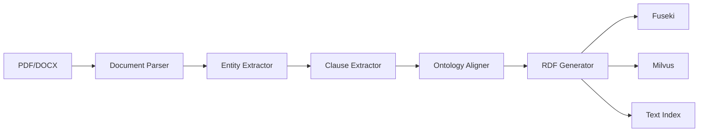

# Document Ingestion Guide

Complete guide to ingesting contracts into the knowledge graph.

**Deployment:** Ingestion runs in the **Ingestion API** (port 8001). Access via **API Gateway** (port 8080) at `/api/v1/ingest/upload` or `/api/v1/ingest/async`, or use `make ingest` (runs inside the ingestion container).

## Overview

The ingestion pipeline processes contracts through multiple specialized agents:

1. **Document Parser** - Extract text from PDF/DOCX
2. **Entity Extractor** - Identify parties, dates, amounts
3. **Clause Extractor** - Classify contract clauses
4. **Ontology Aligner** - Map to ontology concepts
5. **RDF Generator** - Create knowledge graph triples
6. **Vector Indexer** - Generate embeddings for semantic search

## Quick Start

### Ingest All Documents

```bash
# Ingest all documents in examples/
make ingest

# Force reprocess (skip duplicate detection)
make ingest-override
```

### Ingest Single Document

```bash
# Ingest specific file
make ingest-single FILE=examples/contract.pdf

# Or with Python
cd agents
PYTHONPATH=src uv run python ../scripts/ingestion/ingest_single_document.py ../examples/contract.pdf
```

## Ingestion Pipeline

### Pipeline Architecture



### Processing Steps

**1. Document Parsing**
- Extract text from PDF/DOCX
- Preserve structure and metadata
- Handle multi-page documents

**2. Entity Extraction**
- Identify parties (organizations, people)
- Extract dates and amounts
- Recognize locations and jurisdictions

**3. Clause Extraction**
- Classify clause types (termination, payment, liability)
- Extract obligations and rights
- Identify risk factors

**4. Ontology Alignment**
- Map entities to ontology classes
- Infer relationships
- Validate against schema

**5. RDF Generation**
- Create RDF triples
- Generate unique URIs
- Add metadata and provenance

**6. Storage**
- Store in Fuseki (knowledge graph)
- Index in Milvus (vector search)
- Create text index (keyword search)

## Supported Formats

### PDF Documents

```bash
# Standard PDF
make ingest-single FILE=examples/contract.pdf

# Scanned PDF (OCR required)
# Install tesseract first
brew install tesseract  # macOS
sudo apt install tesseract-ocr  # Linux
```

### DOCX Documents

```bash
# Microsoft Word documents
make ingest-single FILE=examples/contract.docx
```

### Batch Processing

```bash
# Process all files in directory
for file in examples/*.pdf; do
    make ingest-single FILE="$file"
done
```

## Configuration

### Ingestion Settings

Edit `agents/.env`:

```bash
# Document processing
UPLOAD_DIRECTORY=./data/uploads
MAX_FILE_SIZE_MB=50

# Duplicate detection
ENABLE_DUPLICATE_CHECK=true
DOCUMENT_REGISTRY_BACKEND=sqlite

# LLM for extraction
LLM_PROVIDER=ollama
OLLAMA_MODEL=llama3.1:8b
```

### Performance Tuning

```bash
# Batch size for LLM calls
LLM_BATCH_SIZE=5

# Parallel processing
MAX_WORKERS=4

# Timeout settings
EXTRACTION_TIMEOUT=300
```

## Monitoring Ingestion

### View Progress

```bash
# Watch logs in real-time
make logs-view

# Monitor specific ingestion
tail -f agents/logs/ingestion/ingestion.log
```

### Check Status

```bash
# Verify data in Fuseki
make check-fuseki-data

# Verify vectors in Milvus
make check-milvus-data

# View ingestion statistics
make logs-analyze-ingestion
```

### Phoenix Observability

```bash
# View LLM traces
open http://localhost:6006

# Monitor:
# - Entity extraction calls
# - Clause classification
# - Ontology alignment
# - Token usage and costs
```

## Advanced Features

### Custom Ontology

```python
# Extend ontology
from agents.ontology_manager import OntologyManager

ontology = OntologyManager()
ontology.add_class("CustomClause", parent="Clause")
ontology.add_property("hasCustomField", domain="CustomClause")
```

### Custom Extractors

```python
# Create custom entity extractor
from agents.ingestion.entity_extraction import EntityExtractionAgent

class CustomEntityExtractor(EntityExtractionAgent):
    async def extract_custom_entities(self, text: str):
        # Your custom logic
        pass
```

### Validation Rules

```python
# Add SHACL validation
from agents.schema_governance import SchemaGovernance

governance = SchemaGovernance()
governance.add_shape("ContractShape", {
    "required": ["hasTitle", "hasParty"],
    "minCount": {"hasParty": 2}
})
```

## Troubleshooting

### Common Issues

**Ingestion Fails**
```bash
# Check services
make health

# View detailed logs
make logs-view

# Check disk space
df -h
```

**Duplicate Detection Issues**
```bash
# Clear registry
rm agents/data/document_registry.db

# Disable duplicate check
ENABLE_DUPLICATE_CHECK=false make ingest
```

**Memory Errors**
```bash
# Reduce batch size
LLM_BATCH_SIZE=1 make ingest

# Increase Docker memory
# Docker Desktop → Settings → Resources → Memory: 8GB+
```

**Slow Processing**
```bash
# Use faster model
OLLAMA_MODEL=qwen2.5-coder:7b make ingest

# Enable parallel processing
MAX_WORKERS=8 make ingest
```

## Best Practices

### Document Preparation

1. **Clean PDFs**: Remove watermarks, headers/footers
2. **OCR Quality**: Ensure scanned documents are readable
3. **File Naming**: Use descriptive names (contract_vendor_date.pdf)
4. **Metadata**: Include document metadata when possible

### Batch Ingestion

```bash
# Process in batches
for batch in batch1/*.pdf batch2/*.pdf; do
    make ingest-single FILE="$batch"
    sleep 5  # Rate limiting
done
```

### Quality Assurance

```bash
# Verify ingestion
make verify

# Check data quality
cd agents
PYTHONPATH=src uv run python ../scripts/analysis/query_data.py

# Review extraction logs
make logs-analyze-ingestion
```

## Next Steps

- **[Retrieval Guide](retrieval.md)**: Query the knowledge graph
- **[Schema Evolution](schema-evolution.md)**: Evolve ontology
- **[Observability](observability.md)**: Monitor system health