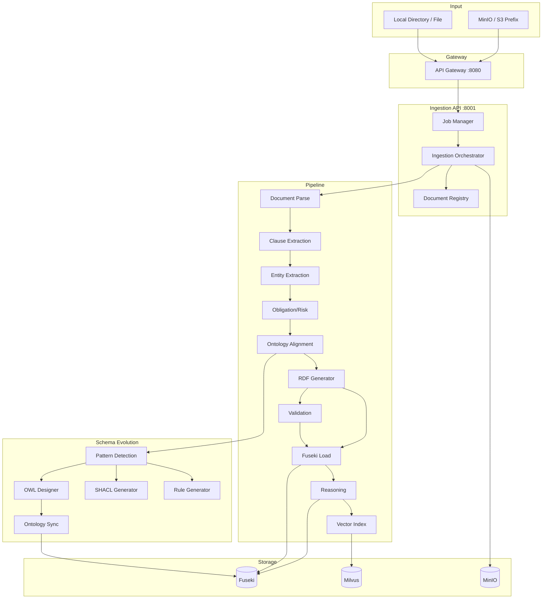
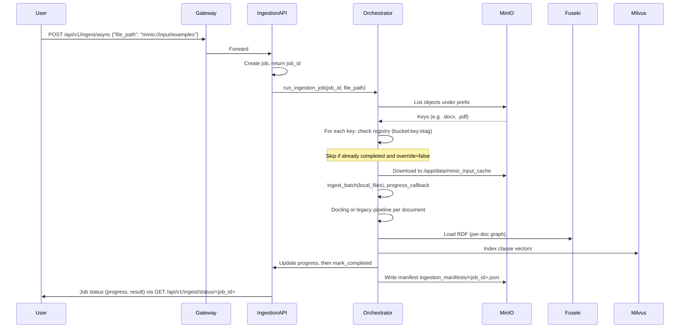
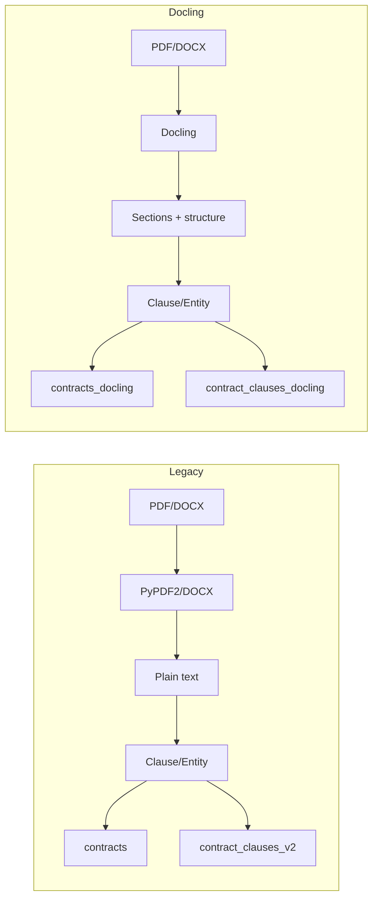
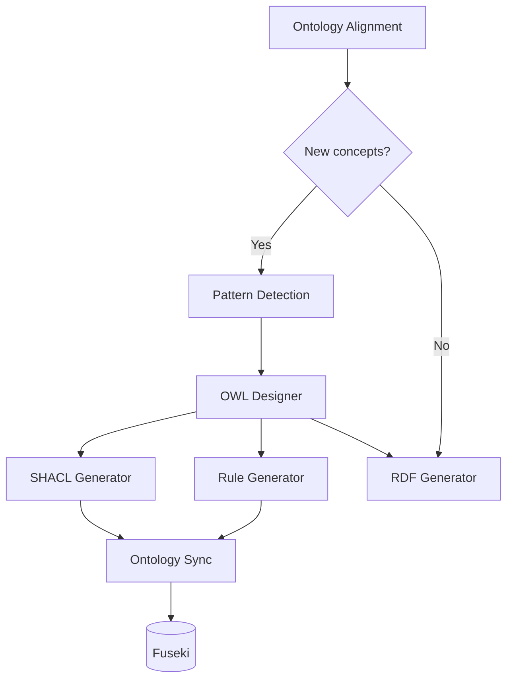

# Document Ingestion Guide

Complete guide to ingesting contracts into the Contract Knowledge Graph. Covers both **legacy** (PDF/DOCX text extraction) and **Docling** (structure-aware) pipelines, MinIO input, schema evolution, and operational details.

**Deployment:** Ingestion runs in the **Ingestion API** (port 8001). Access via **API Gateway** (port 8080) at `/api/v1/ingest/*`, or use the Makefile commands below.

---

## Table of Contents

1. [Overview](#overview)
2. [Architecture](#architecture)
3. [Pipeline Modes: Legacy vs Docling](#pipeline-modes-legacy-vs-docling)
4. [MinIO and Object Storage Input](#minio-and-object-storage-input)
5. [Async Jobs, Progress, and Manifests](#async-jobs-progress-and-manifests)
6. [Schema Evolution](#schema-evolution)
7. [Restart, Idempotency, and Override](#restart-idempotency-and-override)
8. [Configuration](#configuration)
9. [Makefile Commands](#makefile-commands)
10. [Verification and Troubleshooting](#verification-and-troubleshooting)

---

## Overview

The ingestion pipeline turns contract documents (PDF, DOCX) into:

- **Knowledge graph data** in Apache Jena Fuseki (RDF triples, per-document graphs)
- **Vector embeddings** in Milvus for semantic search
- **Structured artifacts** (clauses, entities, RDF, OWL/SHACL when schema evolution is used)

You can run ingestion from **local directories**, **single files**, or **MinIO/S3-compatible** prefixes. The system supports **async jobs** with progress tracking, **ETag-based skip** for unchanged files, and **per-job manifests** in object storage.

---

## Architecture

### High-Level Component View



### End-to-End Data Flow



---

## Pipeline Modes: Legacy vs Docling

Behavior is controlled by **`INGESTION_SOURCE`** in `agents/.env`.

### Legacy Pipeline (`INGESTION_SOURCE=legacy`)

- **Input:** Local files or directory scan.
- **Parsing:** PyPDF2 / python-docx for text extraction (no structure).
- **Targets:** Fuseki dataset `contracts`, Milvus collection `contract_clauses_v2` (or configured legacy collection).
- **Use case:** Simple text extraction and clause/entity classification without document structure.

### Docling Pipeline (`INGESTION_SOURCE=docling`)

- **Input:** Local files, directory, or **MinIO prefix** (`minio://input/examples`).
- **Parsing:** **Docling** (DocTags): sections, headings, tables, structure.
- **Downstream:** Clause extraction uses **sections** and structural hints; RDF gets **document-structure triples** and clause-level DocTags metadata; vector index stores **section_title**, **has_table**, **page_range**, **source_pipeline=docling**.
- **Targets:** Fuseki dataset **`contracts_docling`**, Milvus collection **`contract_clauses_docling`**.
- **Use case:** Structure-aware ingestion, MinIO-driven batches, and richer search/RAG.



---

## MinIO and Object Storage Input

When **`INGESTION_SOURCE=docling`** and object storage is configured, you can ingest from a **MinIO prefix** (e.g. `minio://input/examples`).

### Flow

1. **Parse prefix** – e.g. `minio://input/examples` → bucket + prefix `input/examples/`.
2. **List objects** – all keys under the prefix; filter by extension (e.g. `.pdf`, `.docx`, `.txt`, `.md`).
3. **Skip by identity** – for each key, compute identity `bucket:key:etag` and check the **document registry**. If already **completed** and **override=false**, skip (no re-download, no re-ingest).
4. **Download** – remaining objects are downloaded to a local cache under `/app/data/minio_input_cache/<prefix>/` so the rest of the pipeline sees local paths.
5. **Batch ingest** – run the Docling pipeline on each cached file; **progress_callback** reports progress (e.g. `(skipped_unchanged + done_in_batch) / total_docs`).
6. **Registry update** – after each document, register by **identity hash** (derived from `bucket:key:etag`) so the next run can skip it if unchanged.
7. **Manifest** – write/update **`ingestion_manifests/<job_id>.json`** in MinIO with `job_id`, `prefix`, `created_at`, and `items` (key + status: `discovered` | `skipped_unchanged` | `completed` | `failed`).

### ETag-Based Skip

- **Identity** = `bucket:key:etag`. If the object’s ETag changes (e.g. file replaced in MinIO), the document is **re-ingested** on the next run (same key, new ETag).
- With **override=true**, skip logic is bypassed and all listed documents are re-processed.

### Makefile (MinIO)

```bash
# Submit async job for MinIO prefix (default: input/examples)
make ingest-async-minio

# Custom prefix
make ingest-async-minio PREFIX=input/other

# Force re-ingest all (ignore registry)
make ingest-async-minio-override
```

---

## Async Jobs, Progress, and Manifests

### Creating a Job

- **POST** `/api/v1/ingest/async` with `{"file_path": "minio://input/examples", "override": false}` (or local path).
- Response includes **`job_id`** and **`check_status`** URL.

### Status and Progress

- **GET** `/api/v1/ingest/status/<job_id>` returns:
  - **status:** `pending` | `running` | `completed` | `failed`
  - **progress:** 0–100 (percent)
  - **result:** (when completed) e.g. `files_processed`, `skipped_unchanged`, `results[]` per document
  - **error:** (when failed) message

Progress is updated as documents are processed (and, for MinIO, accounts for skipped-unchanged count).

### Manifests

- For **MinIO** jobs, a manifest is written to object storage: **`ingestion_manifests/<job_id>.json`**.
- Contents: `job_id`, `prefix`, `created_at`, `items`: list of `{ "key": "<object key>", "status": "completed" | "failed" | "skipped_unchanged" }`.
- Use this to see exactly which keys were processed or skipped without calling the job API.

#### Example manifest

Example file in MinIO: `ingestion_manifests/654dc48d-6475-4c1c-9be5-5710d3f1d1d0.json`

```json
{
  "job_id": "654dc48d-6475-4c1c-9be5-5710d3f1d1d0",
  "prefix": "input/examples/",
  "created_at": "2026-03-12T05:21:28.538072",
  "items": [
    { "key": "input/examples/contract_a.docx", "status": "completed" },
    { "key": "input/examples/contract_b.pdf", "status": "failed" },
    { "key": "input/examples/old/contract_c.docx", "status": "skipped_unchanged" }
  ]
}
```

#### What the fields mean

- **`job_id`**: The async ingestion job id (matches the API `/api/v1/ingest/status/<job_id>`).
- **`prefix`**: The MinIO prefix that was scanned (the part after `minio://`).
- **`created_at`**: When the job was created (ISO timestamp).
- **`items[]`**: One entry per discovered object key.
  - **`key`**: Full MinIO object key (including directories).
  - **`status`**:
    - **`discovered`**: initial state right after listing (before processing)
    - **`skipped_unchanged`**: registry says “already completed” for the identity `bucket:key:etag` and `override=false`
    - **`completed`**: ingested successfully
    - **`failed`**: ingestion attempt failed (see the job `result.results[]` or ingestion logs for the error)

#### Why the manifest is useful

- **Audit trail**: durable record of exactly which MinIO keys were considered for a job.
- **“What’s left?” reporting**: you can compute remaining work as keys that are not `completed`/`skipped_unchanged`.
- **Restartability**: if ingestion is interrupted, you can re-run the same prefix; unchanged docs will become `skipped_unchanged` and only remaining/new keys will process.
- **Debugging failures**: quickly list the `failed` keys and retry only those (either by re-uploading/fixing source docs or by running `override=true` for just that prefix).

### Worked Example: What happens when I start MinIO ingestion?

Walkthrough for:

```bash
make ingest-async-minio PREFIX=input/examples
```

- **Job creation**: the gateway calls `POST /api/v1/ingest/async` and returns a **`job_id`** immediately.
- **Discovery**: ingestion lists objects under `input/examples/` recursively and filters by extension.
- **ETag skip / re-ingest**:
  - identity = `bucket:key:etag`
  - if already **COMPLETED** in the registry and `override=false` → **skipped_unchanged**
  - if the object changed (new ETag) → it will be **re-ingested**
- **Download cache**: not-skipped objects are downloaded to `/app/data/minio_input_cache/<prefix>/...`.
- **Docling pipeline** (per document): DocTags → sections/structure → clause/entity extraction → RDF → Fuseki load → reasoning → Milvus indexing.
- **Progress**: status endpoint progress (0–100) advances as each document finishes; for MinIO jobs it includes skipped docs in the percentage.
- **Manifest**: `ingestion_manifests/<job_id>.json` in MinIO is updated with per-key statuses.
- **Final result**: when complete, `make ingest-status JOB_ID=<job-id>` shows `files_processed`, `skipped_unchanged`, and per-document outcomes in `results[]`.

---

## Schema Evolution

During ingestion, the pipeline can **evolve the ontology** when new concepts appear. See [Schema Evolution Guide](schema-evolution.md) for full detail; summary below.

### What Runs During Ingestion

1. **Pattern detection** – New clause types or concepts not in the current ontology.
2. **Ontology designer** – Generates **OWL** for new classes/properties.
3. **SHACL generator** – Generates **SHACL** shapes for validation.
4. **Rule generator** – Generates **inference rules** (e.g. Jena rules).
5. **Ontology sync** – Loads OWL/SHACL/rules into **Fuseki** (when enabled).

### Schema Governance (Optional)

- **Schema versions** can be stored in MinIO (e.g. `schema_versions/<version_id>/`).
- **Latest pointer** (e.g. `latest.json`) indicates the active schema version.
- Orchestrator can record **`schema_version`** on each **IngestionResult** for traceability.

### Diagram (Schema Evolution in Pipeline)



---

## Restart, Idempotency, and Override

### Idempotency

- **Document registry** stores completion status keyed by **content/identity hash** (for MinIO: hash of `bucket:key:etag`).
- **Same file (same ETag)** → skipped when **override=false**.
- **Changed file (new ETag)** → re-ingested.

### Restart Safety

- Jobs are stored in SQLite (`/app/data/jobs.db`); **running** jobs can be restarted by re-submitting (new job_id).
- No automatic resume of a half-finished job; re-run the same prefix and already-completed documents are skipped.

### Override

- **override=false** (default): skip documents already completed (same identity).
- **override=true**: ignore registry and re-process all listed documents.

### Service Restart

- **Restart ingestion API only (no rebuild):**
  ```bash
  make api-restart-ingestion
  ```
- **Rebuild and start (after code changes):**
  ```bash
  make rebuild-ingestion
  ```

---

## Configuration

### Key Environment Variables (`agents/.env`)

| Variable | Description | Example |
|----------|-------------|---------|
| `INGESTION_SOURCE` | Pipeline mode | `docling` or `legacy` |
| `DOCLING_FUSEKI_DATASET` | Fuseki dataset for Docling | `contracts_docling` |
| `DOCLING_MILVUS_COLLECTION` | Milvus collection for Docling | `contract_clauses_docling` |
| `ARTIFACT_STORE_BACKEND` | Where generated artifacts are stored | `local` or `object_storage` |
| `ARTIFACT_STORE_PREFIX` | Object storage prefix for artifacts | `ingestion_artifacts` |
| `ARTIFACT_STORE_CLEANUP_LOCAL` | Delete local artifacts after upload | `true`/`false` |
| Object storage (MinIO) | Endpoint, bucket, keys | See `env.example` |
| `DOCUMENT_REGISTRY_BACKEND` | Registry backend | `sqlite` (or `redis`) |

### Supported File Types

- **Docling:** `.docx`, `.pptx`, `.pdf`, `.doc` (others may be rejected; see logs).
- **Legacy:** Typically PDF, DOCX, plain text as used by the legacy extractors.

---

## Makefile Commands

### Single Query (no YAML)

```bash
# Natural language question (same API as retrieval)
make query Q="How many contracts do we have?"
```

### Run All YAML Test Cases (same query API)

```bash
# Default YAML: agents/tests/test_cases/test_cases_retrieval.yaml
make query-yaml

# Custom YAML (path relative to agents/)
make query-yaml YAML=tests/test_cases/test_cases_quick.yaml
```

### Run One Test Case by ID

```bash
# Run the case with id "termination_analysis" from default YAML
make query-case CASE=termination_analysis

# From another YAML file
make query-case CASE=contract_count YAML=tests/test_cases/test_cases_simple.yaml
```

### Ingestion

| Command | Description |
|---------|-------------|
| `make ingest` | Ingest directory (default `examples`) inside container |
| `make ingest-override` | Same, force reprocess |
| `make ingest-async-minio` | Async MinIO job for `input/examples` |
| `make ingest-async-minio-override` | Same, with override |
| `make ingest-status JOB_ID=<id>` | Job status and result |
| `make ingest-jobs` | List jobs |

### Verification

| Command | Description |
|---------|-------------|
| `make check-fuseki-data` | Fuseki triple counts + **default and Docling datasets** |
| `make check-milvus-data` | Milvus entity counts + **legacy, v2, and Docling collections** |

---

## Verification and Troubleshooting

### Check Data After Ingestion

```bash
# Fuseki: default + Docling dataset
make check-fuseki-data

# Milvus: all collections including contract_clauses_docling
make check-milvus-data
```

### Logs

```bash
# Ingestion API logs
make api-logs-ingestion
# or
tail -f agents/logs/ingestion/ingestion.log
```

### Common Issues

| Issue | What to check |
|-------|----------------|
| MinIO job fails with “INGESTION_SOURCE=docling required” | Set `INGESTION_SOURCE=docling` in `agents/.env`. |
| “No space left on device” | Free Docker/container disk; clear Hugging Face cache in container if using Docling. |
| Fuseki “unsafe memory access” / 500 | Fuseki/JVM issue; increase memory or reduce load. |
| Vector indexing errors | Check Milvus is up; see ingestion log for full exception (vector_indexing). |
| Job result “datetime not JSON serializable” | Fixed in current code (result uses `model_dump(mode="json")`). |

### Document Registry

- Registry prevents re-ingesting the same document (by content/identity) when **override=false**.
- To force re-ingest for all: use **override=true** or clear/change registry (e.g. SQLite DB or Redis keys) if you need a full reset.

---

## Next Steps

- **[Retrieval Guide](retrieval.md)** – Query the knowledge graph and run YAML query tests.
- **[Schema Evolution](schema-evolution.md)** – Ontology extension, SHACL, and rules in detail.
- **[Observability](observability.md)** – Monitoring and health.
