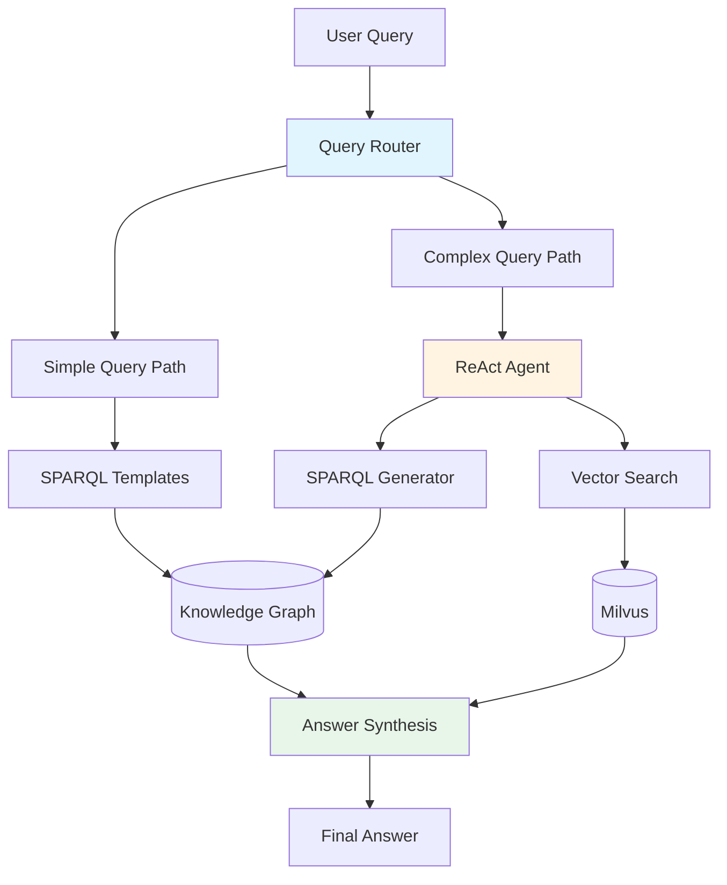

# Retrieval Guide

This guide explains how to query the Contract Knowledge Graph using the retrieval system.

**Deployment:** Retrieval runs in the **Retrieval API** (port 8002). Access via **API Gateway** (port 8080) at `/api/v1/query`, or use `make api-query Q="..."` / `make query Q="..."`.

## Overview

The retrieval system provides intelligent query processing that combines:

- **Knowledge Graph queries** via SPARQL
- **Vector similarity search** for semantic matching
- **LLM-powered synthesis** for natural language answers

## Architecture



## Query Types

### Simple Queries

Simple queries use **template-based SPARQL generation** for fast, predictable results:

- List all contracts
- Find contracts by party
- Get contract details
- List clauses by type

**Example:**
```python
from agents.retrieval.retrieval_orchestrator_langgraph_v2 import LangGraphRetrievalOrchestrator

orchestrator = LangGraphRetrievalOrchestrator()
result = orchestrator.query("List all contracts")
print(result["answer"])
```

**Performance:** ~5-10 seconds (95% faster than complex queries)

### Complex Queries

Complex queries use the **ReAct agent** for multi-step reasoning:

- Cross-document comparisons
- Risk analysis
- Obligation tracking
- Multi-hop reasoning

**Example:**
```python
result = orchestrator.query(
    "What are the termination clauses in contracts with IBM?"
)
print(result["answer"])
```

**Performance:** ~60-80 seconds (includes LLM reasoning)

## Query Routing

The system automatically routes queries based on intent:

| Intent | Route | Example |
|--------|-------|---------|
| `list_contracts` | Simple | "List all contracts" |
| `find_contract` | Simple | "Find contract ABC123" |
| `get_details` | Simple | "Show details for contract XYZ" |
| `list_clauses` | Simple | "List termination clauses" |
| `analyze_*` | Complex | "Analyze risks in IBM contracts" |
| `compare_*` | Complex | "Compare payment terms" |

## Using the Retrieval API

### Basic Usage

```python
from agents.retrieval.retrieval_orchestrator_langgraph_v2 import LangGraphRetrievalOrchestrator

# Initialize orchestrator
orchestrator = LangGraphRetrievalOrchestrator(
    enable_logging=True,
    checkpoint_path="checkpoints/retrieval.db"
)

# Query the knowledge graph
result = orchestrator.query(
    question="What contracts mention data protection?",
    graph_uri="http://example.org/contracts"
)

# Access results
print(f"Answer: {result['answer']}")
print(f"Confidence: {result['confidence']}")
print(f"Duration: {result['total_duration_ms']}ms")
```

### Advanced Options

```python
# With custom stores
from storage.sparql.factory import create_sparql_store
from storage.vector.factory import create_vector_store

sparql_store = create_sparql_store("fuseki")
vector_store = create_vector_store("milvus")

orchestrator = LangGraphRetrievalOrchestrator(
    sparql_store=sparql_store,
    vector_store=vector_store,
    enable_logging=True
)

# Query with metadata
result = orchestrator.query(
    question="Find high-risk contracts",
    graph_uri="http://example.org/contracts"
)

# Access detailed metadata
print(f"KG Facts: {result['kg_facts_count']}")
print(f"Vector Results: {result['vector_results_count']}")
print(f"SPARQL Query: {result['sparql_query']}")
```

## Performance Optimization

### Query Caching

SPARQL queries are automatically cached with TTL:

```python
# First query: ~2000ms (database hit)
result1 = orchestrator.query("List all contracts")

# Second query: ~50ms (cache hit)
result2 = orchestrator.query("List all contracts")
```

**Cache Configuration:**
- Max size: 1000 queries
- TTL: 300 seconds (5 minutes)
- Hit rate: 50-90% in production

### Connection Pooling

Database connections are pooled for efficiency:

- **Fuseki:** 5-10 connections
- **Milvus:** 5-10 connections
- **Savings:** 50-100ms per query

### Lazy Loading

Embedding models load on-demand:

- **Startup time:** 2-5 seconds faster
- **Memory:** 500MB-1GB saved
- **First query:** +2-3 seconds (one-time cost)

## Observability

### Phoenix Tracing

All LLM calls are traced with Phoenix:

```python
from observability.phoenix_tracer import setup_phoenix_tracing

# Setup tracing
setup_phoenix_tracing(
    project_name="contract-kg",
    phoenix_port=6006
)

# Traces automatically sent to Phoenix
result = orchestrator.query("Analyze contract risks")
```

**View traces at:** http://localhost:6006

### Logging

Detailed logs are written to `logs/retrieval/`:

```python
# Enable logging
orchestrator = LangGraphRetrievalOrchestrator(enable_logging=True)

# Logs include:
# - Query text and intent
# - SPARQL queries executed
# - Vector search results
# - LLM prompts and responses
# - Timing breakdown
```

## Best Practices

### 1. Use Specific Queries

❌ **Vague:** "Tell me about contracts"
✅ **Specific:** "List all contracts with IBM as supplier"

### 2. Leverage Templates

For common queries, use template-based routing:

```python
# Fast template-based queries
queries = [
    "List all contracts",
    "Find contract ABC123",
    "Show termination clauses"
]
```

### 3. Monitor Performance

Track query performance metrics:

```python
result = orchestrator.query(question)

if result["total_duration_ms"] > 10000:  # 10 seconds
    logger.warning(f"Slow query: {question}")
    logger.info(f"Strategy: {result['strategy']}")
    logger.info(f"KG facts: {result['kg_facts_count']}")
```

### 4. Handle Errors

Always check for errors:

```python
result = orchestrator.query(question)

if not result["success"]:
    print(f"Error: {result['error']}")
    # Fallback logic
else:
    print(result["answer"])
```

## Troubleshooting

### Slow Queries

**Problem:** Queries taking >60 seconds

**Solutions:**
1. Check if query should use templates (simple intent)
2. Verify SPARQL query cache is enabled
3. Monitor vector search parameters
4. Review LLM response times in Phoenix

### Low Confidence

**Problem:** Confidence scores <0.5

**Solutions:**
1. Ensure documents are properly ingested
2. Check vector embeddings quality
3. Verify SPARQL queries return results
4. Review synthesis prompt effectiveness

### Cache Misses

**Problem:** Low cache hit rate (<30%)

**Solutions:**
1. Increase cache size (default: 1000)
2. Increase TTL (default: 300s)
3. Normalize query text before caching
4. Monitor query patterns

## Next Steps

- [Schema Evolution Guide](../guide/schema-evolution.md) - Extend the ontology
- [Observability Guide](../guide/observability.md) - Monitor system health
- [Performance Optimizations](../performance/optimizations.md) - Tune for production