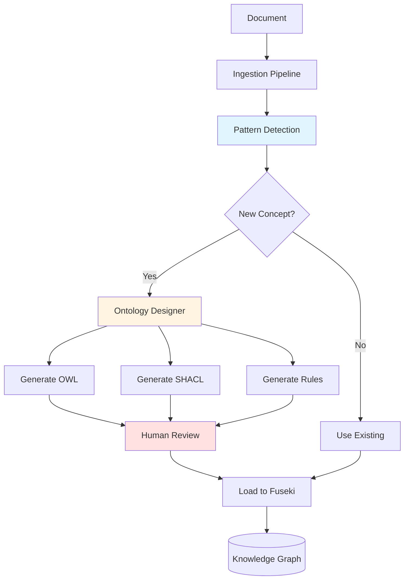

# Schema Evolution Guide

This guide explains how the system automatically evolves the ontology schema as new concepts are discovered during document ingestion.

## Overview

The schema evolution system enables the knowledge graph to **grow organically** by:

1. **Detecting new concepts** in ingested documents
2. **Generating OWL definitions** for discovered concepts
3. **Creating SHACL validation rules** for data quality
4. **Generating reasoning rules** for inference

## Architecture



## Components

### 1. Pattern Detection

Identifies new concepts during ingestion:

```python
from agents.schema_evolution.pattern_detection import PatternDetectionAgent

detector = PatternDetectionAgent()

# Analyze extracted entities
patterns = detector.detect_patterns(
    entities=[
        {"type": "clause", "text": "Data retention period: 7 years"},
        {"type": "clause", "text": "Personal data must be encrypted"}
    ],
    existing_ontology=ontology_graph
)

# Results
for pattern in patterns:
    print(f"New concept: {pattern.name}")
    print(f"Type: {pattern.suggestion_type}")
    print(f"Parent: {pattern.parent_class}")
```

**Detection Strategies:**
- Frequency analysis (concepts appearing >3 times)
- Semantic similarity to existing classes
- Domain-specific patterns (e.g., "X clause", "Y obligation")

### 2. Ontology Designer

Generates OWL definitions for new concepts:

```python
from agents.schema_evolution.ontology_designer import OntologyDesignerAgent

designer = OntologyDesignerAgent()

# Generate OWL for new concept
result = designer.generate_owl(
    suggestion={
        "name": "DataProtectionClause",
        "type": "class",
        "description": "Clause related to data protection and privacy",
        "parent_class": "proc:Clause",
        "examples": ["GDPR compliance", "data retention"]
    }
)

# Save generated OWL
print(result.owl_triples)
print(f"Saved to: {result.file_path}")
```

**Generated OWL Example:**
```turtle
@prefix proc: <http://example.org/procurement#> .
@prefix owl: <http://www.w3.org/2002/07/owl#> .
@prefix rdfs: <http://www.w3.org/2000/01/rdf-schema#> .

proc:DataProtectionClause a owl:Class ;
    rdfs:subClassOf proc:Clause ;
    rdfs:label "Data Protection Clause" ;
    rdfs:comment "Clause specifying data protection and privacy requirements" .

proc:dataRetentionPeriod a owl:DatatypeProperty ;
    rdfs:domain proc:DataProtectionClause ;
    rdfs:range xsd:duration ;
    rdfs:label "data retention period" ;
    rdfs:comment "Duration for which data must be retained" .
```

### 3. SHACL Generator

Creates validation rules for data quality:

```python
from agents.schema_evolution.shacl_generator import SHACLGeneratorAgent

shacl_gen = SHACLGeneratorAgent()

# Generate SHACL shapes
result = shacl_gen.generate_shacl(
    class_name="DataProtectionClause",
    properties=["dataRetentionPeriod", "encryptionRequired"]
)

print(result.shacl_shapes)
```

**Generated SHACL Example:**
```turtle
@prefix sh: <http://www.w3.org/ns/shacl#> .
@prefix proc: <http://example.org/procurement#> .

proc:DataProtectionClauseShape a sh:NodeShape ;
    sh:targetClass proc:DataProtectionClause ;
    sh:property [
        sh:path proc:dataRetentionPeriod ;
        sh:datatype xsd:duration ;
        sh:minCount 1 ;
        sh:message "Data retention period is required"
    ] ;
    sh:property [
        sh:path proc:encryptionRequired ;
        sh:datatype xsd:boolean ;
        sh:message "Encryption requirement must be specified"
    ] .
```

### 4. Rule Generator

Creates reasoning rules for inference:

```python
from agents.schema_evolution.rule_generator import RuleGeneratorAgent

rule_gen = RuleGeneratorAgent()

# Generate Jena rules
result = rule_gen.generate_rules(
    class_name="DataProtectionClause",
    domain_context="procurement contracts"
)

print(result.rules)
```

**Generated Rules Example:**
```
# Data Protection Risk Rules
[dataProtectionRisk:
    (?contract proc:hasClause ?clause)
    (?clause rdf:type proc:DataProtectionClause)
    (?clause proc:encryptionRequired false)
    ->
    (?contract proc:hasRisk [
        rdf:type proc:DataProtectionRisk ;
        proc:severity "high" ;
        proc:description "Contract lacks encryption requirements"
    ])
]
```

## Workflow

### Automatic Evolution

During ingestion, the system automatically:

1. **Extracts entities** from documents
2. **Detects patterns** not in current ontology
3. **Generates OWL/SHACL/Rules** for new concepts
4. **Saves to review directory** (`data/generated/`)
5. **Logs suggestions** for human review

```python
from agents.ingestion.ingestion_orchestrator import IngestionOrchestrator

orchestrator = IngestionOrchestrator(
    enable_schema_evolution=True  # Enable automatic evolution
)

# Ingest document
result = orchestrator.ingest_document(
    file_path="contract.pdf",
    graph_uri="http://example.org/contracts"
)

# Check for schema suggestions
if result.schema_suggestions:
    print(f"Found {len(result.schema_suggestions)} new concepts")
    for suggestion in result.schema_suggestions:
        print(f"- {suggestion.name} ({suggestion.suggestion_type})")
```

### Manual Review

Review generated artifacts before loading:

```bash
# View generated OWL
ls data/generated/owl/

# Review SHACL shapes
ls data/generated/shacl/

# Check reasoning rules
ls data/generated/rules/
```

### Loading Extensions

After review, load to Fuseki:

```python
from agents.schema_evolution.ontology_designer import OntologyDesignerAgent

designer = OntologyDesignerAgent()

# Load approved extensions
result = designer.extend_ontology(
    suggestions=[
        {"name": "DataProtectionClause", "type": "class", ...},
        {"name": "ComplianceObligation", "type": "class", ...}
    ],
    load_to_fuseki=True,
    graph_uri="http://example.org/ontology"
)

print(f"Loaded {result.total_triples} triples")
```

## Configuration

### Enable/Disable Evolution

```python
# In config.py or .env
ENABLE_SCHEMA_EVOLUTION=true

# Or programmatically
orchestrator = IngestionOrchestrator(
    enable_schema_evolution=True
)
```

### Detection Thresholds

```python
detector = PatternDetectionAgent(
    min_frequency=3,        # Minimum occurrences to suggest
    similarity_threshold=0.7,  # Semantic similarity cutoff
    confidence_threshold=0.8   # Minimum confidence score
)
```

### Output Directories

```python
# Configure output paths
GENERATED_OWL_DIR = "data/generated/owl"
GENERATED_SHACL_DIR = "data/generated/shacl"
GENERATED_RULES_DIR = "data/generated/rules"
```

## Best Practices

### 1. Review Before Loading

Always review generated artifacts:

```bash
# Check OWL syntax
rapper -i turtle data/generated/owl/DataProtectionClause.ttl

# Validate SHACL
# Use SHACL validator tool

# Test rules
# Load to test graph first
```

### 2. Maintain Naming Conventions

Ensure generated names follow conventions:

- **Classes:** PascalCase (e.g., `DataProtectionClause`)
- **Properties:** camelCase (e.g., `dataRetentionPeriod`)
- **Prefix:** Use `proc:` for domain concepts

### 3. Document Extensions

Add comments to generated artifacts:

```turtle
proc:DataProtectionClause a owl:Class ;
    rdfs:subClassOf proc:Clause ;
    rdfs:label "Data Protection Clause" ;
    rdfs:comment "Auto-generated from contract analysis on 2024-01-15" ;
    proc:generatedBy "OntologyDesignerAgent" ;
    proc:reviewedBy "human-reviewer" .
```

### 4. Version Control

Track ontology versions:

```bash
# Commit generated artifacts
git add data/generated/
git commit -m "Add DataProtectionClause extension"

# Tag ontology versions
git tag -a v1.1.0 -m "Added data protection concepts"
```

## Monitoring

### Track Suggestions

Monitor schema evolution activity:

```python
# View suggestion logs
tail -f logs/schema_evolution/suggestions.log

# Analyze patterns
python scripts/analysis/analyze_schema_suggestions.py
```

### Metrics

Key metrics to track:

- **Suggestions per document:** Average new concepts discovered
- **Approval rate:** % of suggestions loaded to ontology
- **Coverage growth:** Ontology size over time
- **Validation errors:** SHACL violations after loading

## Troubleshooting

### Invalid OWL Generated

**Problem:** Generated OWL has syntax errors

**Solutions:**
1. Check LLM prompt templates
2. Validate with rapper/RDFLib before saving
3. Review examples in training data
4. Adjust generation parameters

### Too Many Suggestions

**Problem:** System suggests too many concepts

**Solutions:**
1. Increase `min_frequency` threshold
2. Raise `confidence_threshold`
3. Improve pattern detection filters
4. Review domain-specific stop words

### Duplicate Concepts

**Problem:** Similar concepts suggested multiple times

**Solutions:**
1. Improve semantic similarity matching
2. Normalize concept names before detection
3. Check existing ontology completeness
4. Use synonym detection

## Next Steps

- [Ingestion Guide](../guide/ingestion.md) - Document ingestion pipeline
- [Retrieval Guide](../guide/retrieval.md) - Query the knowledge graph
- [Architecture Overview](../architecture/overview.md) - System design