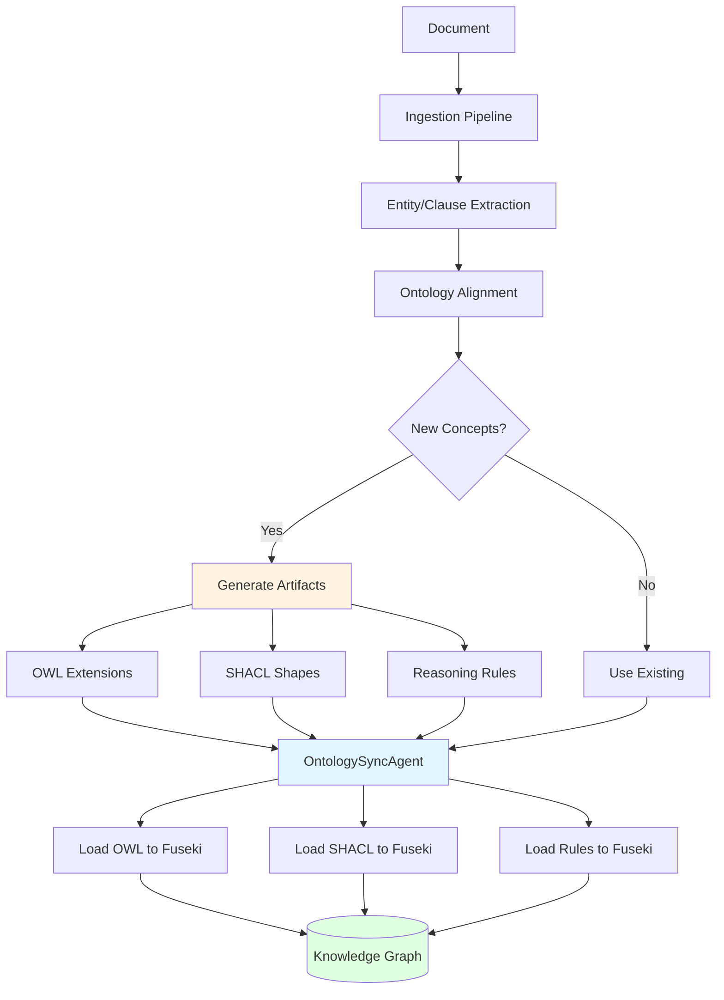

# SHACL and Rules Integration Guide

This guide explains the automatic loading of SHACL validation shapes and reasoning rules into the knowledge graph during ingestion.

## Overview

The system now **automatically loads** SHACL shapes and reasoning rules into Fuseki during the ingestion pipeline, eliminating the need for manual script execution.

## Architecture



## Key Components

### 1. OntologySyncAgent

The `OntologySyncAgent` now includes two new methods for automatic loading:

#### sync_shacl_shapes()

Loads all SHACL validation shapes from `data/generated/shacl/` into Fuseki:

```python
from agents.ingestion.ontology_sync_agent import OntologySyncAgent

sync_agent = OntologySyncAgent(sparql_store=fuseki_client)

# Load all SHACL shapes
stats = await sync_agent.sync_shacl_shapes()

print(f"Loaded: {stats['loaded']}/{stats['total']}")
print(f"Failed: {stats['failed']}")
```

**Features:**
- Loads each shape into its own named graph: `http://procurement.kg/shacl#{filename}`
- Validates Turtle syntax before loading
- Returns detailed statistics
- Handles errors gracefully with logging

#### sync_reasoning_rules()

Loads all reasoning rules from `data/generated/rules/` into Fuseki:

```python
# Load all reasoning rules
stats = await sync_agent.sync_reasoning_rules()

print(f"Loaded: {stats['loaded']}/{stats['total']}")
```

**Features:**
- Stores rules as metadata in named graphs: `http://procurement.kg/rules#{filename}`
- Preserves SPARQL CONSTRUCT queries for future execution
- Enables rule-based inference
- Tracks rule provenance

### 2. Integration into Ingestion Pipeline

The ingestion orchestrator automatically calls these methods after ontology synchronization:

```python
# In ingestion_orchestrator.py (ADAPTIVE mode)

# 1. Generate OWL extensions
owl_results = await ontology_designer.generate_owl(suggestions)

# 2. Sync OWL to Fuseki
await ontology_sync_agent.sync_extension(owl_file)

# 3. Generate SHACL shapes
shacl_results = await shacl_generator.generate_for_owl_class(...)

# 4. Generate reasoning rules
rule_results = await rule_generator.generate_rule(...)

# 5. Reload ontology from Fuseki
await ontology_manager.reload_from_fuseki(...)

# 6. **NEW**: Automatically load SHACL shapes and rules
if generated_shacl or generated_rules:
    # Load SHACL shapes
    if generated_shacl:
        shacl_stats = await ontology_sync_agent.sync_shacl_shapes()
        logger.info(f"SHACL shapes loaded: {shacl_stats['loaded']}/{shacl_stats['total']}")
    
    # Load reasoning rules
    if generated_rules:
        rules_stats = await ontology_sync_agent.sync_reasoning_rules()
        logger.info(f"Reasoning rules loaded: {rules_stats['loaded']}/{rules_stats['total']}")
```

### 3. WatsonX LLM Fix

Fixed issue where WatsonX LLM generates URIs with line breaks in SHACL shapes:

```python
# In shacl_generator.py

def _post_process_shacl(self, shacl_text: str, class_name: str) -> str:
    """Post-process SHACL to fix common LLM generation issues."""
    import re
    
    # Fix line breaks in URIs (critical fix for WatsonX output)
    def fix_uri_linebreaks(match):
        uri = match.group(0)
        uri = uri.replace('\n', '').replace('\r', '')
        uri = re.sub(r'\s+', '', uri)
        return uri
    
    # Fix URIs in angle brackets
    shacl_text = re.sub(
        r'<[^>]*\n[^>]*>', 
        fix_uri_linebreaks, 
        shacl_text, 
        flags=re.MULTILINE
    )
    
    return shacl_text
```

## Usage

### Automatic Loading (Recommended)

Simply run the ingestion pipeline in ADAPTIVE mode:

```bash
# Ingest documents - SHACL and rules load automatically
make ingest
```

The system will:
1. Extract entities and clauses
2. Detect new concepts
3. Generate OWL, SHACL, and rules
4. **Automatically load everything to Fuseki**
5. Log statistics for transparency

### Manual Loading

For manual control or fixing existing files:

```bash
# Load SHACL shapes and rules manually
cd agents
PYTHONPATH=src uv run python ../scripts/setup/load_shacl_and_rules.py
```

### Fix Existing Malformed Files

If you have existing SHACL files with URI line breaks:

```bash
# Fix malformed SHACL files
cd agents
PYTHONPATH=src uv run python ../scripts/setup/fix_shacl_files.py
```

This script:
- Scans all `.ttl` files in `data/generated/shacl/`
- Fixes URI line breaks
- Validates Turtle syntax
- Reports success/failure for each file

## Verification

### Using Make Command

```bash
# Verify all data loaded
make verify-data
```

Output shows:
- Total triples in Fuseki
- Contract and clause counts
- SHACL shapes count
- Named graphs list
- Milvus vector count

### Using Python

```python
from scripts.verification.verify_data_loaded import verify_all

# Run comprehensive verification
await verify_all()
```

### Check Named Graphs

```sparql
# Query to list all SHACL graphs
SELECT ?graph (COUNT(?s) as ?triples)
WHERE {
  GRAPH ?graph {
    ?s ?p ?o .
    FILTER(STRSTARTS(STR(?graph), "http://procurement.kg/shacl#"))
  }
}
GROUP BY ?graph
ORDER BY ?graph
```

## Configuration

### Enable/Disable Automatic Loading

```python
# In ingestion_orchestrator.py
config = IngestionConfig(
    ontology_evolution_mode=OntologyEvolutionMode.ADAPTIVE,  # Enable auto-loading
    generate_shacl=True,  # Generate SHACL shapes
    generate_rules=True,  # Generate reasoning rules
)
```

### Custom Directories

```python
# Specify custom directories
sync_agent = OntologySyncAgent(sparql_store=fuseki_client)

# Load from custom directory
await sync_agent.sync_shacl_shapes(shacl_dir="custom/path/shacl")
await sync_agent.sync_reasoning_rules(rules_dir="custom/path/rules")
```

## Named Graph Structure

### SHACL Shapes

Each SHACL shape file is loaded into its own named graph:

```
http://procurement.kg/shacl#DataProtectionClause
http://procurement.kg/shacl#TerminationClause
http://procurement.kg/shacl#LiabilityClause
...
```

### Reasoning Rules

Each rule file is stored as metadata in a named graph:

```
http://procurement.kg/rules#data_protection_risk
http://procurement.kg/rules#termination_notice_validation
http://procurement.kg/rules#liability_inference
...
```

Rule metadata format:
```turtle
@prefix rule: <http://procurement.kg/rules#> .
@prefix rdfs: <http://www.w3.org/2000/01/rdf-schema#> .

<http://procurement.kg/rules#data_protection_risk> a rule:ReasoningRule ;
    rdfs:label "data_protection_risk" ;
    rule:sparqlQuery """
    CONSTRUCT {
        ?contract proc:hasRisk ?risk .
        ?risk a proc:DataProtectionRisk ;
              proc:severity "high" .
    }
    WHERE {
        ?contract proc:hasClause ?clause .
        ?clause a proc:DataProtectionClause ;
                proc:encryptionRequired false .
    }
    """ .
```

## Best Practices

### 1. Review Generated Artifacts

Before automatic loading, review generated files:

```bash
# View generated SHACL shapes
ls -lh agents/data/generated/shacl/

# View generated rules
ls -lh agents/data/generated/rules/

# Check for syntax errors
rapper -i turtle agents/data/generated/shacl/DataProtectionClause.ttl
```

### 2. Monitor Loading Statistics

Check logs for loading statistics:

```bash
# View ingestion logs
make logs-view

# Look for SHACL/rules loading messages
grep "SHACL shapes loaded" agents/logs/ingestion/*.log
grep "Reasoning rules loaded" agents/logs/ingestion/*.log
```

### 3. Verify After Ingestion

Always verify data after ingestion:

```bash
# Quick verification
make verify-data

# Detailed analysis
cd agents
PYTHONPATH=src uv run python ../scripts/verification/verify_data_loaded.py
```

### 4. Handle Failures Gracefully

The system logs failures but continues ingestion:

```python
# In logs, you'll see:
# ✓ SHACL shapes loaded: 73/79 (failed: 6)
# ✓ Reasoning rules loaded: 7/7 (failed: 0)
```

Failed files are logged for manual review.

## Troubleshooting

### SHACL Files Not Loading

**Problem:** SHACL shapes not appearing in Fuseki

**Solutions:**
1. Check file syntax: `rapper -i turtle file.ttl`
2. Verify directory path: `ls agents/data/generated/shacl/`
3. Check Fuseki connectivity: `curl http://localhost:3030/$/ping`
4. Review logs: `make logs-view`

### URI Line Break Errors

**Problem:** Turtle parsing errors due to line breaks in URIs

**Solutions:**
1. Run fix script: `python scripts/setup/fix_shacl_files.py`
2. Check WatsonX model configuration
3. Verify post-processing is enabled in `shacl_generator.py`

### Rules Not Executing

**Problem:** Reasoning rules loaded but not executing

**Solutions:**
1. Verify rule syntax in Fuseki
2. Check rule metadata is correct
3. Ensure Jena reasoner is configured
4. Test rules manually with SPARQL CONSTRUCT

## Performance

### Loading Statistics

Typical loading performance:

| Operation | Files | Time | Throughput |
|-----------|-------|------|------------|
| SHACL Loading | 73 shapes | ~2-3s | ~25 files/s |
| Rules Loading | 7 rules | ~1s | ~7 files/s |
| Total | 80 artifacts | ~3-4s | ~20 files/s |

### Optimization Tips

1. **Batch Loading**: Load multiple files in parallel (already implemented)
2. **Caching**: Skip unchanged files (future enhancement)
3. **Validation**: Pre-validate before loading to avoid rollbacks

## Next Steps

- [Schema Evolution Guide](schema-evolution.md) - How schemas evolve
- [Ingestion Guide](ingestion.md) - Complete ingestion pipeline
- [Architecture Overview](../architecture/overview.md) - System design
- [Quickstart Guide](../getting-started/quickstart.md) - Get started quickly

## Summary

The automatic SHACL and rules loading integration:

✅ **Eliminates manual steps** - No separate scripts needed
✅ **Ensures consistency** - Always loads after generation
✅ **Provides transparency** - Detailed logging and statistics
✅ **Handles errors gracefully** - Continues on failures
✅ **Supports verification** - Easy to check what was loaded
✅ **Works with WatsonX** - Fixed URI line break issues

This makes the ingestion pipeline truly end-to-end, from document upload to fully validated knowledge graph with reasoning capabilities.