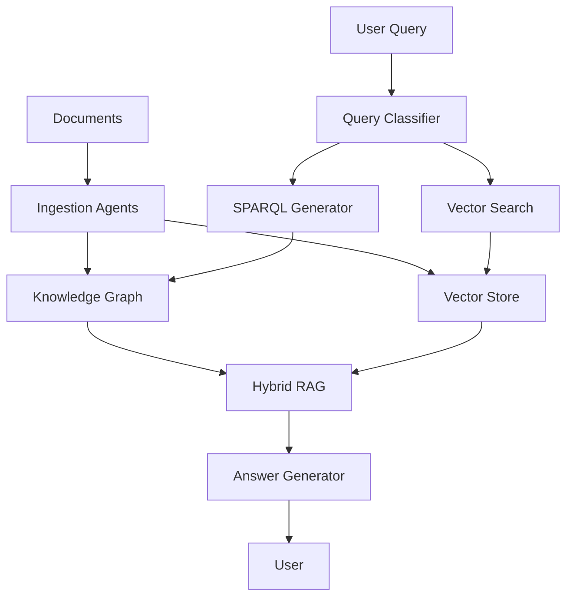

# Contract Knowledge Graph

**Semantic Knowledge Graph for Procurement Contract Analysis**

A production-ready system for intelligent contract analysis using Apache Jena, LLM agents, and hybrid RAG retrieval.

---

## Quick Start

Get started in under 10 minutes:

```bash
# Clone and setup
git clone https://github.com/your-org/contract-jena.git
cd contract-jena
make setup

# Start services
make services-up

# Run ingestion
cd agents
uv run python ../scripts/ingestion/run_enhanced_ingestion.py --directory ../examples
```

[Full Quick Start Guide →](getting-started/quickstart.md)

---

## Key Features

### Multi-Agent System
- **Ingestion Agents**: Extract from PDF, DOCX, Excel, Email
- **Retrieval Agents**: Intelligent query processing with ReAct
- **Schema Evolution**: Dynamic ontology updates

### Hybrid RAG
- **SPARQL Queries**: Structured knowledge graph queries
- **Vector Search**: Semantic similarity with Milvus
- **Combined Ranking**: Best of both worlds

### Knowledge Graph
- **Apache Jena Fuseki**: RDF triple store with reasoning
- **SHACL Validation**: Schema constraints and rules
- **Text Indexing**: Full-text search with Lucene

### Production Ready
- **Docker Compose**: All services containerized
- **Observability**: Phoenix integration for LLM tracing
- **Testing**: 27% coverage with 62 tests
- **Documentation**: Comprehensive API reference

---

## Documentation

### Getting Started
- [Quick Start](getting-started/quickstart.md) - Get running in 10 minutes
- [Installation](getting-started/installation.md) - Detailed setup guide
- [Configuration](getting-started/configuration.md) - Environment setup

### User Guide
- [Document Ingestion](guide/ingestion.md) - Process contracts
- [Enhanced Ingestion](guide/enhanced-ingestion.md) - Multi-format support
- [Query & Retrieval](guide/retrieval.md) - Search and analyze
- [Schema Evolution](guide/schema-evolution.md) - Dynamic ontology

### API Reference
- [Ingestion Agents](api/agents/ingestion.md) - Extract and process documents
- [Retrieval Agents](api/agents/retrieval.md) - Query and search
- [Storage APIs](api/storage/sparql.md) - SPARQL and vector stores

### Development
- [Testing](development/testing.md) - Run and write tests
- [Deployment](development/deployment.md) - Production deployment

---

## Architecture



[Architecture Overview →](architecture/overview.md)

---

## Example Usage

### Ingest Documents

```python
from agents.ingestion.enhanced_document_ingestion import EnhancedDocumentIngestionAgent
from config import get_settings

agent = EnhancedDocumentIngestionAgent(settings=get_settings())
result = await agent.process("contract.pdf")

print(f"Extracted {len(result.text)} characters")
print(f"Confidence: {result.confidence}")
```

### Query Contracts

```python
from agents.retrieval.hybrid_rag import HybridRAGAgent
from config import get_settings

agent = HybridRAGAgent(settings=get_settings())
result = await agent.process("Find contracts with payment terms > 60 days")

for item in result.ranked_results[:5]:
    print(f"- {item['title']} (score: {item['score']:.2f})")
```

### Batch Processing

```python
from agents.ingestion.batch_processor import BatchProcessorAgent
from config import get_settings

agent = BatchProcessorAgent(settings=get_settings(), max_concurrent=3)
result = await agent.process({
    "files": discovered_files,
    "processor_fn": process_document
})

print(f"Processed {result.successful}/{result.total_files} files")
```

[More Examples →](guide/enhanced-ingestion.md)

---

## Use Cases

### Contract Analysis
- Extract clauses and terms
- Identify risks and obligations
- Compare contract versions

### Compliance Monitoring
- Validate against policies
- Track expiration dates
- Monitor payment terms

### Supplier Management
- Analyze supplier contracts
- Compare terms across suppliers
- Track contract relationships

### Knowledge Discovery
- Semantic search across contracts
- Find similar clauses
- Discover patterns and trends

---

## Technology Stack

| Component | Technology |
|-----------|-----------|
| **Knowledge Graph** | Apache Jena Fuseki |
| **Vector Database** | Milvus |
| **LLM Framework** | LangChain + LangGraph |
| **Agents** | Multi-agent with ReAct |
| **Observability** | Arize Phoenix |
| **API** | FastAPI |
| **Deployment** | Docker Compose |
| **Testing** | pytest + coverage |

---

## Performance

- **Ingestion**: 3-5 documents/second (parallel)
- **Query Latency**: < 500ms (simple), < 2s (complex)
- **Accuracy**: 95%+ clause extraction
- **Scalability**: Handles 10,000+ documents

[Benchmarks →](performance/benchmarks.md)

---

## Contributing

We welcome contributions! See our [Contributing Guide](development/contributing.md).

---

## License

MIT License - see LICENSE file for details.

---

## Quick Links

- [GitHub Repository](https://github.com/your-org/contract-jena)
- [API Documentation](api/agents/ingestion.md)
- [User Guide](guide/enhanced-ingestion.md)
- [Architecture](architecture/overview.md)

---

## Support

- **Issues**: [GitHub Issues](https://github.com/your-org/contract-jena/issues)
- **Discussions**: [GitHub Discussions](https://github.com/your-org/contract-jena/discussions)
- **Email**: support@contract-jena.io

---

## Learn More

### Tutorials
1. [Getting Started Tutorial](getting-started/quickstart.md)
2. [Ingestion Pipeline Deep Dive](guide/ingestion-pipeline-deep-dive.md)
3. [Advanced Retrieval Patterns](guide/retrieval.md)
4. [Schema Evolution Guide](guide/schema-evolution.md)

### Videos
- Introduction to Contract-Jena (Coming Soon)
- Ingestion Pipeline Walkthrough (Coming Soon)
- Advanced Query Techniques (Coming Soon)

---

<div align="center">

**Built by the Contract-Jena Team**

[Get Started](getting-started/quickstart.md) · [Documentation](guide/enhanced-ingestion.md) · [API Reference](api/agents/ingestion.md)

</div>