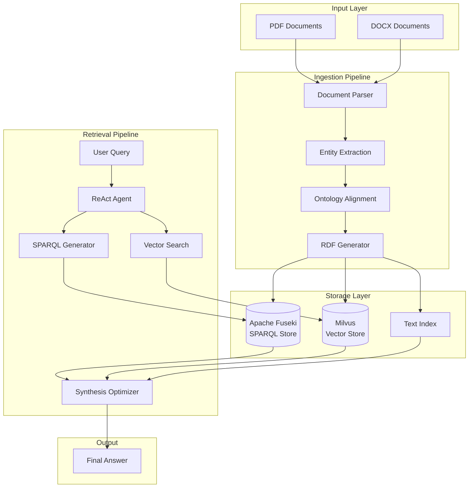

# Contract Knowledge Graph

A production-ready semantic knowledge graph system for procurement contract analysis, powered by multi-agent AI and hybrid RAG architecture.

## Overview

Contract-Jena combines **Apache Jena** knowledge graphs with **LangGraph** multi-agent orchestration to provide intelligent contract analysis through:

- **Semantic Knowledge Graph**: RDF/OWL ontology for contract relationships
- **Hybrid RAG**: Vector search + SPARQL queries + text indexing
- **Multi-Agent System**: Specialized agents for ingestion, retrieval, and schema evolution
- **Production-Ready**: Observability, caching, connection pooling, and performance optimizations

## Key Features

### Multi-Agent Architecture
- **Ingestion Agents**: Document parsing, entity extraction, ontology alignment
- **Retrieval Agents**: ReAct reasoning, query decomposition, synthesis optimization
- **Schema Evolution**: Pattern detection, rule generation, SHACL validation

### Hybrid RAG System
- **Vector Search**: Semantic similarity via Milvus embeddings
- **Knowledge Graph**: Structured queries via Apache Fuseki SPARQL
- **Text Index**: Fast keyword search with Jena text indexing
- **Intelligent Routing**: Automatic selection of optimal retrieval strategy

### Performance Optimizations
- **Query Caching**: LRU cache with TTL for SPARQL queries (50-90% hit rate)
- **Lazy Loading**: Deferred embedding model initialization (saves 2-5s startup)
- **Connection Pooling**: Reusable connections for Milvus and Fuseki
- **Template-Based SPARQL**: Fast path for simple queries (95% speed improvement)
- **Async I/O**: Non-blocking file operations

### Observability
- **Phoenix Tracing**: LLM call tracking and performance monitoring
- **Structured Logging**: JSON logs with context propagation
- **Checkpointing**: LangGraph state persistence for fault tolerance

## Quick Start

```bash
# Clone repository
git clone https://github.com/your-org/contract-jena.git
cd contract-jena

# Setup environment
make setup

# Start services (Fuseki, Milvus, Ollama, Phoenix)
make services-up

# Run ingestion pipeline
make ingest

# Test retrieval
make test-evaluate YAML=tests/test_cases/test_cases_simple.yaml
```

## Documentation Structure

- **[Getting Started](getting-started/quickstart.md)**: Installation and first steps
- **[Architecture](architecture/overview.md)**: System design and components
- **[User Guide](guide/ingestion.md)**: How to use the system
- **[API Reference](api/agents/ingestion.md)**: Detailed API documentation
- **[Performance](performance/optimizations.md)**: Benchmarks and tuning

## Architecture Diagram



## Technology Stack

- **Knowledge Graph**: Apache Jena, Fuseki, RDF/OWL
- **Vector Database**: Milvus with sentence-transformers
- **LLM Framework**: LangChain, LangGraph
- **LLM Providers**: IBM watsonx.ai, Ollama (local)
- **Observability**: Arize Phoenix
- **Language**: Python 3.11+
- **Package Manager**: uv

## Performance Metrics

| Metric | Value |
|--------|-------|
| Simple Query Time | 5-10s (with template matching) |
| Complex Query Time | 60-120s (multi-hop reasoning) |
| Ingestion Speed | ~30s per document |
| Cache Hit Rate | 50-90% (SPARQL queries) |
| Startup Time | <5s (with lazy loading) |

## Contributing

See [Contributing Guide](development/contributing.md) for development setup and guidelines.

## License

[Your License Here]

## Links

- [GitHub Repository](https://github.com/your-org/contract-jena)
- [Issue Tracker](https://github.com/your-org/contract-jena/issues)
- [Phoenix Dashboard](http://localhost:6006) (when running locally)